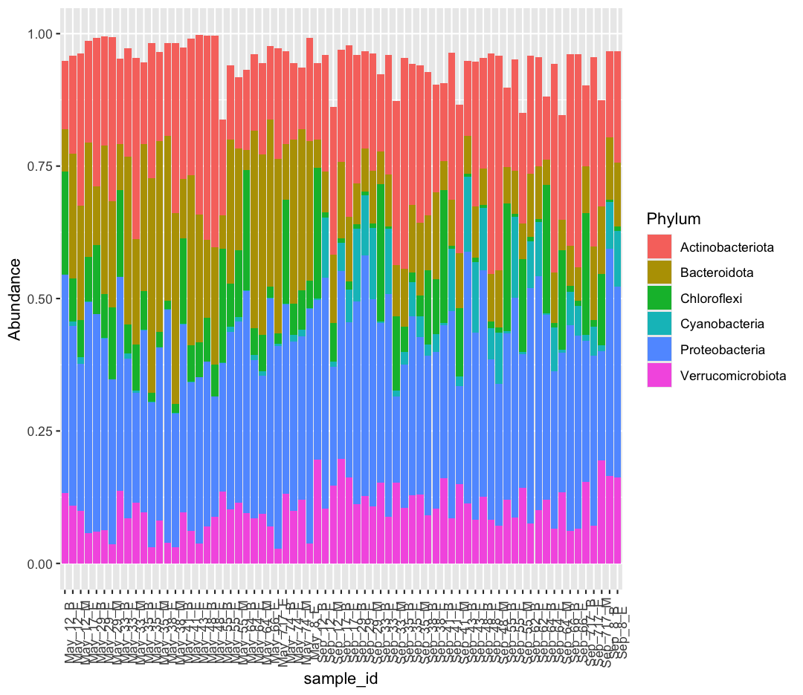
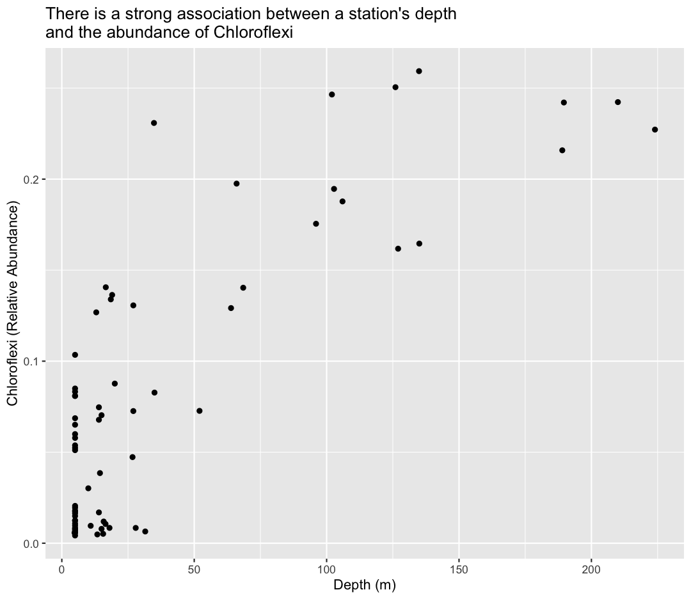
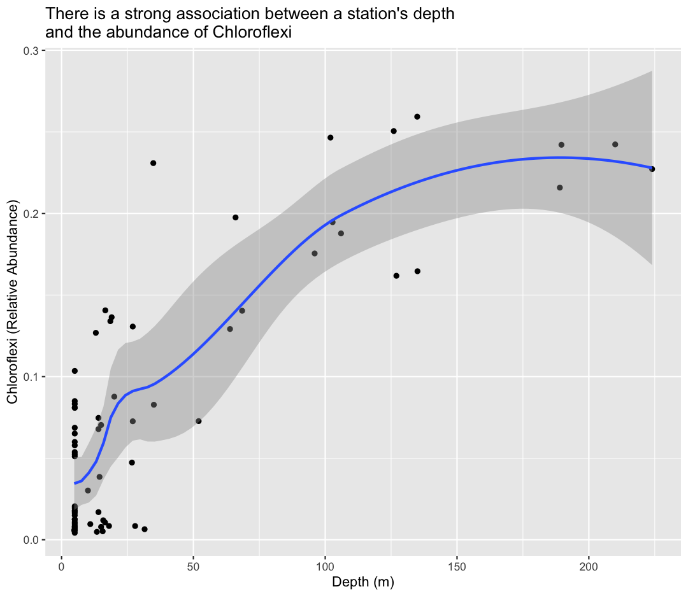
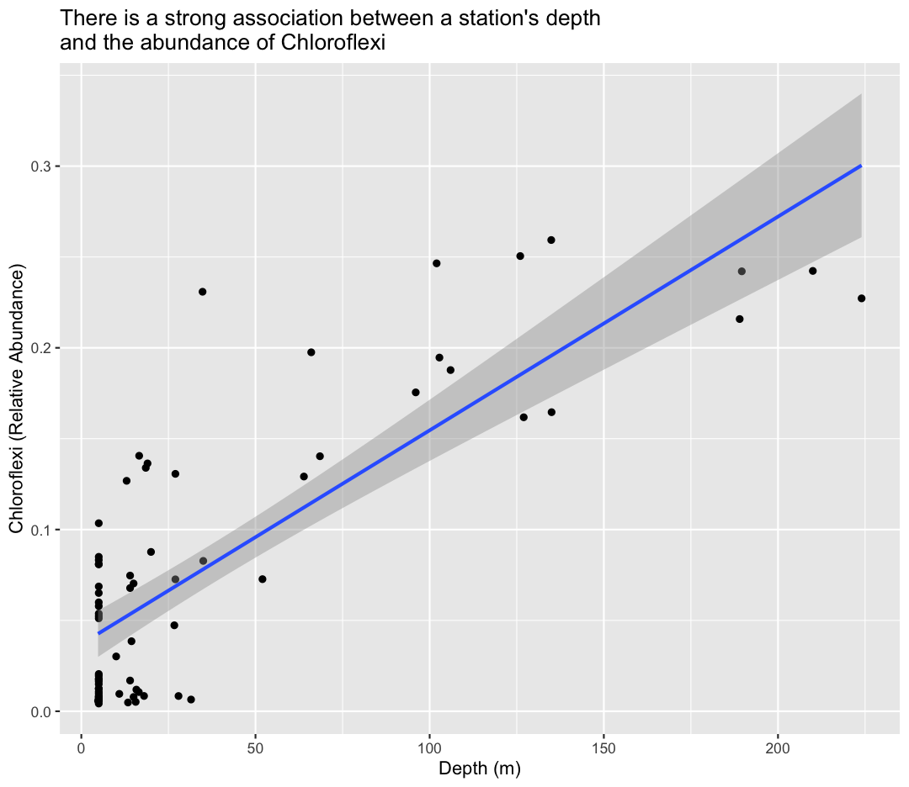

---
# Please do not edit this file directly; it is auto generated.
# Instead, please edit 04-r-data-analysis.md in _episodes_rmd/
title: "R for Data Analysis"
source: Rmd
teaching: 150
exercises: 15
questions:
- "How can I summarize my data in R?"
- "How can R help make my research more reproducible?"
- "How can I combine two datasets from different sources?"
- "How can data tidying facilitate answering analysis questions?"
objectives:
- "To become familiar with the functions of the `dplyr` and `tidyr` packages."
- "To be able to use `dplyr` and `tidyr` to prepare data for analysis."
- "To be able to combine two different data sources using joins."
- "To be able to create plots and summary tables to answer analysis questions."
keypoints:
- "Package loading is an important first step in preparing an R environment."
- "Data analsyis in R facilitates reproducible research."
- "There are many useful functions in the `tidyverse` packages that can aid in data analysis."
- "Assessing data source and structure is an important first step in analysis."
- "Preparing data for analysis can take significant effort and planning."
editor_options: 
  chunk_output_type: console
---

### Contents

1.  [Getting started](#getting-started)
    -   [Loading in the data](#loading-in-the-data)
2.  [An introduction to data analysis in R using `dplyr`](#intro-data-analysis)
    -   [Get stats fast with `summarize()`](#get-stats-fast-with-summarize)
    -   [Narrow down rows with `filter()`](#narrow-down-rows-with-filter)
    -   [Grouping rows using `group_by()`](#grouping-rows-using-group_by)
    -   [Make new variables with `mutate()`](#make-new-variables-with-mutate)
    -   [Subset columns using `select()`](#subset-columns-using-select)
    -   [Changing the shape of the data](#changing-the-shape-of-the-data)
3.  [Cleaning up data](#cleaning-up-data)
4.  [Joining data frames](#joining-data-frames)
5.  [Analyzing combined data](#analyzing-combined-data)
6.  [Finishing with Git and GitHub](#Finishing-with-Git-and-GitHub)

# Getting Started

First, navigate to the un-reports directory however you'd like and open `un-report.Rproj`.
This should open the un-report R project in RStudio.
You can check this by seeing if the Files in the bottom right of RStudio are the ones in your `un-report` directory.

Yesterday we spent a lot of time making plots in R using the ggplot2 package. Visualizing data using plots is a very powerful skill in R, but what if we would like to work with only a subset of our data? Or clean up messy data, calculate summary statistics, create a new variable, or join two datasets together? There are several different methods for doing this in R, and we will touch on a few today using functions the `dplyr` package.

First, we will create a new RScript file for our work. Open RStudio. Choose "File" \> "New File" \> "RScript". We will save this file as `data_analysis.R`

### Loading in the data

We will start by importing the complete sample dataset that we used yesterday into our fresh new R session. Today let's type them into the console ourselves: `sample_data <- read_csv("data/sample_data.csv")`

> ## Exercise
>
> If we look in the console now, we'll see we've received an error message saying that R "could not find the function `read_csv()`". *Hint: Packages...*
>
> > ## Solution
> >
> > What this means is that R cannot find the function we are trying to call. The reason for this usually is that we are trying to run a function from a package that we have not yet loaded. This is a very common error message that you will probably see a lot when using R. It's important to remember that you will need to load any packages you want to use into R each time you start a new session. The `read_csv` function comes from the `readr` package which is included in the `tidyverse` package so we will just load the `tidyverse` package and run the import code again.
> {: .solution}
{: .challenge}

Now that we know what's wrong, We will use the `read_csv()` function from the Tidyverse `readr` package. Load the `tidyverse` package and sample dataset using the code below.

~~~
library(tidyverse)
~~~
{: .language-r}

~~~
── Attaching core tidyverse packages ────────────────────────────────────────────────────────────────────────────── tidyverse 2.0.0 ──
✔ dplyr     1.1.4     ✔ readr     2.1.5
✔ forcats   1.0.0     ✔ stringr   1.5.1
✔ ggplot2   3.5.1     ✔ tibble    3.2.1
✔ lubridate 1.9.3     ✔ tidyr     1.3.1
✔ purrr     1.0.2     
── Conflicts ──────────────────────────────────────────────────────────────────────────────────────────────── tidyverse_conflicts() ──
✖ dplyr::filter() masks stats::filter()
✖ dplyr::lag()    masks stats::lag()
ℹ Use the conflicted package (<http://conflicted.r-lib.org/>) to force all conflicts to become errors
~~~
{: .output}

The output in your console shows that by doing this, we attach several useful packages for data wrangling, including `readr`. Check out these packages and their documentation at [tidyverse.org](https://www.tidyverse.org)

> **Reminder:** Many of these packages, including `dplyr` , come with "Cheatsheets" found under the **Help** RStudio menu tab.

Reload your data:

~~~
sample_data <- read_csv("data/sample_data.csv")
~~~
{: .language-r}

~~~
Rows: 71 Columns: 9
── Column specification ──────────────────────────────────────────────────────────────────────────────────────────────────────────────
Delimiter: ","
chr (2): sample_id, env_group
dbl (7): depth, cells_per_ml, temperature, total_nitrogen, total_phosphorus,...

ℹ Use `spec()` to retrieve the full column specification for this data.
ℹ Specify the column types or set `show_col_types = FALSE` to quiet this message.
~~~
{: .output}

Notice that the output of the `read_csv()` function is pretty informative. It tells us the name of all of our column headers as well as how it interpreted the data type. This birds-eye-view can help you take a quick look that everything is how we expect it to be.

Now we have the tools necessary to work through this lesson.

# An introduction to data analysis in R using `dplyr` {#intro-data-analysis}

## Get stats fast with `summarize()` {#get-stats-fast-with-summarize}

[*Back to top*](#contents)

Let's say we would like to know what is the mean (average) cell abundance in our dataset. R has a built in function function called `mean()` that will calculate this value for us. We can apply that function to our cells_per_ml column using the `summarize()` function. Here's what that looks like:

~~~
summarize(sample_data, average_cells=mean(cells_per_ml))
~~~
{: .language-r}

~~~
# A tibble: 1 × 1
  average_cells
          <dbl>
1      4046023.
~~~
{: .output}

When we call `summarize()`, we can use any of the column names of our data object as values to pass to other functions. `summarize()` will return a new data object and our value will be returned as a column.

> **Note:** The `summarize()` and `summarise()` perform identical functions.

We name this new column so we can use in a future argument. So the `average_cells=` part tells `summarize()` to use "average_cells" as the name of the new column. Note that you don't have to quotes around this new name as long as it starts with a letter and doesn't include a space.

Instead of including the data as an argument, we can use the *pipe operator* `%>%` to pass the data value into the `summarize` function. 

~~~
sample_data %>% summarize(average_cells=mean(cells_per_ml))
~~~
{: .language-r}

~~~
# A tibble: 1 × 1
  average_cells
          <dbl>
1      4046023.
~~~
{: .output}
 
This line of code will do the exact same thing as our first summary command, but the piping function tells R to use the `sample_data` dataframe as the first argument in the next function.

This lets us "chain" together multiple functions, which will be helpful later. Note that the pipe (`%>%`) is a bit different from using the ggplot plus (`+`). Pipes take the output from the left side and use it as input to the right side. Plusses layer on additional information (right side) to a preexisting plot (left side). 
 
We can also add an <kdb>Enter</kdb> to make it look nicer:  

~~~
sample_data %>%
  summarize(average_cells=mean(cells_per_ml))
~~~
{: .language-r}

~~~
# A tibble: 1 × 1
  average_cells
          <dbl>
1      4046023.
~~~
{: .output}

Using the *pipe operator* `%>%` and enter command makes our code more readable. The  *pipe operator* `%>%` also helps to avoid using nested functions and minimizes the need for new variables.

Since we use the pipe operator so often, there is a keyboard shortcut for it in RStudio. You can press <kdb>Ctrl</kdb>+<kdb>Shift</kdb>+<kdb>M<kdb> on Windows or <kdb>Cmd<kdb>+<kdb>Shift<kdb>+<kdb>M<kdb> on a Mac.

> ## Pro tip: Saving a new dataframe
> Notice that when we run the following code, we are not actually saving a new variable: 
> 
> ~~~
> sample_data %>%
>   summarize(average_cells=mean(cells_per_ml))
> ~~~
> {: .language-r}
> This simply outputs what we have created, but does not change actually change `sample_data` or save a new dataframe. To save a new dataframe, we could run: 
> 
> ~~~
> sample_data_summarized <- sample_data %>%
>   summarize(average_cells=mean(cells_per_ml))
> ~~~
> {: .language-r}
> Or if we want to change `sample_data` itself: 
> 
> ~~~
> sample_data <- sample_data %>%
>   summarize(average_cells=mean(cells_per_ml))
> ~~~
> {: .language-r}
> IMPORTANT: This would overwrite the existing `sample_data` object. Let's not do this!
> 
> For now, we will not be saving dataframes, since we are just experimenting with `dyplr` functions, but it will be useful later on in this lesson. 
> 
{: .callout}

## Narrow down rows with `filter()` {#narrow-down-rows-with-filter}

[*Back to top*](#contents)

Let's take a look at the value we just calculated, which tells us the average cell abundance for all rows in the data was 4,046,023. However, we previously saw that cell abundance varied widely between our environmental groups. It may be more informative to calculate average cell abundance for each of those groups separately. 

Let's start by just calculating cell abundance within the Deep group. To do that, we will use the `filter()` function to only use rows for that group before calculating the mean value.

~~~
sample_data %>%
  filter(env_group == "Deep") %>%
  summarize(average=mean(cells_per_ml))
~~~
{: .language-r}

~~~
# A tibble: 1 × 1
   average
     <dbl>
1 1879707.
~~~
{: .output}

> ## Filtering the dataset
>
> What is the average chlorophyll concentration in Deep samples? *Hint: the column headers identified by `read_csv()` showed us there was a column called chlorophyll in the dataset*
>
> > ## Solution
> >
> > 
> > ~~~
> > sample_data %>%
> > filter(env_group == "Deep") %>%
> > summarize(average_chl=mean(chlorophyll))
> > ~~~
> > {: .language-r}
> > 
> > 
> > 
> > ~~~
> > # A tibble: 1 × 1
> >   average_chl
> >         <dbl>
> > 1       0.220
> > ~~~
> > {: .output}
> > {: .source}
> > By combining `filter()` and `summarize()` we were able to calculate the mean chlorophyll in the Deep samples.
> {: .solution}
>  What about in shallow September?
>
> > ## Solution
> >
> > 
> > ~~~
> > sample_data %>%
> > filter(env_group == "Shallow_September") %>%
> > summarize(average_chl=mean(chlorophyll))
> > ~~~
> > {: .language-r}
> > 
> > 
> > 
> > ~~~
> > # A tibble: 1 × 1
> >   average_chl
> >         <dbl>
> > 1        2.09
> > ~~~
> > {: .output}
> > {: .source}
> > Wow - much higher than in the deep samples!.
> {: .solution}
{: .challenge}

Notice how the pipe operator (`%>%`) allows us to combine these two simple steps into a more complicated data extraction?. We took the data, filtered out the rows, then took the mean value. The argument we pass to `filter()` needs to be some expression that will return TRUE or FALSE. We can use comparisons like `>` (greater than) and `<` (less than) for example. Here we tested for equality using a double equals sign `==`. You use `==` (double equals) when testing if two values are equal, and you use `=` (single equals) when naming arguments that you are passing to functions. Try changing it to use `filter(env_group = "Deep")` and see what happens.

## Grouping rows using `group_by()` {#grouping-rows-using-group_by}

[*Back to top*](#contents)

We see that the cell abundance in Deep samples is much lower than the value we got using all of the rows. We saw that by using filtering, we can calculate statistics for each group separately, but we need to do this one at a time. Rather that doing a bunch of different `filter()` statements, we can instead use the `group_by()` function. The function allows us to tell the code to treat the rows in logical groups, so rather than summarizing over all the rows, we will get one summary value for each group. Here's what that will look like:

~~~
sample_data %>%
  group_by(env_group) %>%
  summarize(average=mean(cells_per_ml))
~~~
{: .language-r}

~~~
# A tibble: 3 × 2
  env_group          average
  <chr>                <dbl>
1 Deep              1879707.
2 Shallow_May       4004784.
3 Shallow_September 5906967.
~~~
{: .output}

The `group_by()` function expects you to pass in the name of a column (or multiple columns separated by comma) in your data. 

Note that you might get a message about the summarize function regrouping the output by 'env_group'. This simply indicates what the function is grouping by. 

> ## Grouping the data
>
> Try calculating the average temperature by env_group.
>
> > ## Solution
> >
> > 
> > ~~~
> > sample_data %>%
> > group_by(env_group) %>%
> > summarize(average=mean(temperature))
> > ~~~
> > {: .language-r}
> > 
> > 
> > 
> > ~~~
> > # A tibble: 3 × 2
> >   env_group         average
> >   <chr>               <dbl>
> > 1 Deep                 4.28
> > 2 Shallow_May          7.76
> > 3 Shallow_September   18.3 
> > ~~~
> > {: .output}
> > {: .source}
> >
> > By combining `group_by()` and `summarize()` we are able to calculate the mean temperature by environmental group.
> {: .solution}
{: .challenge}

You can also create more than one new column when you call `summarize()`. To do so, you must separate your columns with a comma. Building on the code from the last exercise, let's add a new column that calculates the minimum cell abundance for each env_group. 

~~~
sample_data %>%
  group_by(env_group) %>%
  summarize(average=mean(cells_per_ml), min=min(cells_per_ml))
~~~
{: .language-r}

~~~
# A tibble: 3 × 3
  env_group          average      min
  <chr>                <dbl>    <dbl>
1 Deep              1879707. 1246414.
2 Shallow_May       4004784. 2300782.
3 Shallow_September 5906967. 3563527.
~~~
{: .output}

## Make new variables with `mutate()` {#make-new-variables-with-mutate}

[*Back to top*](#contents)

Each time we ran `summarize()`, we got back fewer rows than passed in. We either got one row back, or one row per group. But sometimes we want to create a new column in our data without changing the number of rows. The function we use to create new columns is called `mutate()`.

We have a column for the total nitrogen and the total phosphorus. Often, we also want to report the ratio between these two nutrients (researchers often report this as a molar ratio, but for simplicity we'll just use their masses). Here's what such a `mutate()` command would look like:

~~~
sample_data %>%
  mutate(tn_tp_ratio = total_nitrogen / total_phosphorus)
~~~
{: .language-r}

~~~
# A tibble: 71 × 10
   sample_id env_group   depth cells_per_ml temperature total_nitrogen
   <chr>     <chr>       <dbl>        <dbl>       <dbl>          <dbl>
 1 May_12_B  Deep         103.     2058864.        4.07            465
 2 May_12_E  Shallow_May    5      4696827.        7.01            465
 3 May_12_M  Shallow_May   15      4808339.        6.14            474
 4 May_17_E  Shallow_May    5      3738681.        5.99            492
 5 May_29_B  Deep          27      2153086.        4.67            525
 6 May_29_E  Shallow_May    5      3124920.        5.97            521
 7 May_29_M  Shallow_May   19      2566156.        5.69            539
 8 May_33_B  Deep         135      2293177.        3.87            505
 9 May_33_E  Shallow_May    5      5480859.        7.93            473
10 May_33_M  Shallow_May   20      3114433.        4.53            515
# ℹ 61 more rows
# ℹ 4 more variables: total_phosphorus <dbl>, diss_org_carbon <dbl>,
#   chlorophyll <dbl>, tn_tp_ratio <dbl>
~~~
{: .output}

This will add a new column called "tn_tp_ratio" to our data. We use the column names as if they were regular values that we want to perform mathematical operations on and provide the name in front of an equals sign like we have done with `summarize()`

> ## `mutate()`
> We can also multiply by constants or other numbers using mutate - remember how in the plotting lesson we made a plot with cells_per_ml in millions? Try making a new column for this dataframe called cellsInMillions that is the cell abundance in millions. 
> 
> > ## Solution: 
> > 
> > ~~~
> > sample_data %>%  
> > mutate(tn_tp_ratio = total_nitrogen / total_phosphorus, 
> >        cellsInMillions = cells_per_ml / 1000000)  
> > ~~~
> > {: .language-r}
> > 
> > 
> > 
> > ~~~
> > # A tibble: 71 × 11
> >    sample_id env_group   depth cells_per_ml temperature total_nitrogen
> >    <chr>     <chr>       <dbl>        <dbl>       <dbl>          <dbl>
> >  1 May_12_B  Deep         103.     2058864.        4.07            465
> >  2 May_12_E  Shallow_May    5      4696827.        7.01            465
> >  3 May_12_M  Shallow_May   15      4808339.        6.14            474
> >  4 May_17_E  Shallow_May    5      3738681.        5.99            492
> >  5 May_29_B  Deep          27      2153086.        4.67            525
> >  6 May_29_E  Shallow_May    5      3124920.        5.97            521
> >  7 May_29_M  Shallow_May   19      2566156.        5.69            539
> >  8 May_33_B  Deep         135      2293177.        3.87            505
> >  9 May_33_E  Shallow_May    5      5480859.        7.93            473
> > 10 May_33_M  Shallow_May   20      3114433.        4.53            515
> > # ℹ 61 more rows
> > # ℹ 5 more variables: total_phosphorus <dbl>, diss_org_carbon <dbl>,
> > #   chlorophyll <dbl>, tn_tp_ratio <dbl>, cellsInMillions <dbl>
> > ~~~
> > {: .output}
> {: .solution}
{: .challenge}
 

## Subset columns using `select()` {#subset-columns-using-select}

[*Back to top*](#contents)

We use the `filter()` function to choose a subset of the rows from our data, but when we want to choose a subset of columns from our data we use `select()`. For example, if we only wanted to see the sample IDs ("sample_id") and depth values, we can do:

~~~
sample_data %>%
  select(sample_id, depth)
~~~
{: .language-r}

~~~
# A tibble: 71 × 2
   sample_id depth
   <chr>     <dbl>
 1 May_12_B   103.
 2 May_12_E     5 
 3 May_12_M    15 
 4 May_17_E     5 
 5 May_29_B    27 
 6 May_29_E     5 
 7 May_29_M    19 
 8 May_33_B   135 
 9 May_33_E     5 
10 May_33_M    20 
# ℹ 61 more rows
~~~
{: .output}

We can also use `select()` to drop/remove particular columns by putting a minus sign (`-`) in front of the column name. For example, if we want everything but the env_group column, we can do:

~~~
sample_data %>%
  select(-env_group)
~~~
{: .language-r}

~~~
# A tibble: 71 × 8
   sample_id depth cells_per_ml temperature total_nitrogen total_phosphorus
   <chr>     <dbl>        <dbl>       <dbl>          <dbl>            <dbl>
 1 May_12_B   103.     2058864.        4.07            465             3.78
 2 May_12_E     5      4696827.        7.01            465             4.39
 3 May_12_M    15      4808339.        6.14            474             5.37
 4 May_17_E     5      3738681.        5.99            492             4.67
 5 May_29_B    27      2153086.        4.67            525             4.44
 6 May_29_E     5      3124920.        5.97            521             3.71
 7 May_29_M    19      2566156.        5.69            539             4.23
 8 May_33_B   135      2293177.        3.87            505             4.18
 9 May_33_E     5      5480859.        7.93            473             6.64
10 May_33_M    20      3114433.        4.53            515             4.14
# ℹ 61 more rows
# ℹ 2 more variables: diss_org_carbon <dbl>, chlorophyll <dbl>
~~~
{: .output}

> ## selecting columns 
> Create a dataframe with only the `sample_id`, `env_group`, `depth`, `temperature`, and `cells_per_ml` columns. 
> 
> > ## Solution: 
> > There are multiple ways to do this exercise. Here are two different possibilities. 
> > 
> > 
> > ~~~
> > sample_data %>%
> >   select(sample_id, env_group, depth, temperature, cells_per_ml)
> > ~~~
> > {: .language-r}
> > 
> > 
> > 
> > ~~~
> > # A tibble: 71 × 5
> >    sample_id env_group   depth temperature cells_per_ml
> >    <chr>     <chr>       <dbl>       <dbl>        <dbl>
> >  1 May_12_B  Deep         103.        4.07     2058864.
> >  2 May_12_E  Shallow_May    5         7.01     4696827.
> >  3 May_12_M  Shallow_May   15         6.14     4808339.
> >  4 May_17_E  Shallow_May    5         5.99     3738681.
> >  5 May_29_B  Deep          27         4.67     2153086.
> >  6 May_29_E  Shallow_May    5         5.97     3124920.
> >  7 May_29_M  Shallow_May   19         5.69     2566156.
> >  8 May_33_B  Deep         135         3.87     2293177.
> >  9 May_33_E  Shallow_May    5         7.93     5480859.
> > 10 May_33_M  Shallow_May   20         4.53     3114433.
> > # ℹ 61 more rows
> > ~~~
> > {: .output}
> > 
> > ~~~
> > sample_data %>%
> >   select(-total_nitrogen, -total_phosphorus, -diss_org_carbon, -chlorophyll)
> > ~~~
> > {: .language-r}
> > 
> > 
> > 
> > ~~~
> > # A tibble: 71 × 5
> >    sample_id env_group   depth cells_per_ml temperature
> >    <chr>     <chr>       <dbl>        <dbl>       <dbl>
> >  1 May_12_B  Deep         103.     2058864.        4.07
> >  2 May_12_E  Shallow_May    5      4696827.        7.01
> >  3 May_12_M  Shallow_May   15      4808339.        6.14
> >  4 May_17_E  Shallow_May    5      3738681.        5.99
> >  5 May_29_B  Deep          27      2153086.        4.67
> >  6 May_29_E  Shallow_May    5      3124920.        5.97
> >  7 May_29_M  Shallow_May   19      2566156.        5.69
> >  8 May_33_B  Deep         135      2293177.        3.87
> >  9 May_33_E  Shallow_May    5      5480859.        7.93
> > 10 May_33_M  Shallow_May   20      3114433.        4.53
> > # ℹ 61 more rows
> > ~~~
> > {: .output}
> > Did you notice that the order of columns also changed, to match the order of arguments in the select function?
> {: .solution}
{: .challenge}

> ## Pro tip: Selecting a range of columns
> Sometimes, we want to select a range of contiguous columns. Rather than writing out each column name, we can use the `:` operator to selecting a range of columns
> 
> ~~~
> sample_data %>%
>   select(sample_id:temperature)
> ~~~
> {: .language-r}
> We can also drop a range of columns in this way, though we need to include some extra parentheses:
> 
> ~~~
> sample_data %>%
>   select(-(total_nitrogen:chlorophyll))
> ~~~
> {: .language-r}
{: .callout}

> ## Bonus: Using helper functions with `select()`
>
> The `select()` function has a bunch of helper functions that are handy if you are working with a dataset that has a lot of columns. You can see these helper functions on the `?select` help page. For example, let's say we wanted to select the sample_id column and all the columns that start with "total". You can do that with:
> 
> 
> ~~~
> sample_data %>%
>   select(sample_id, starts_with("total"))
> ~~~
> {: .language-r}
> 
> 
> 
> ~~~
> # A tibble: 71 × 3
>    sample_id total_nitrogen total_phosphorus
>    <chr>              <dbl>            <dbl>
>  1 May_12_B             465             3.78
>  2 May_12_E             465             4.39
>  3 May_12_M             474             5.37
>  4 May_17_E             492             4.67
>  5 May_29_B             525             4.44
>  6 May_29_E             521             3.71
>  7 May_29_M             539             4.23
>  8 May_33_B             505             4.18
>  9 May_33_E             473             6.64
> 10 May_33_M             515             4.14
> # ℹ 61 more rows
> ~~~
> {: .output}
> This returns just the three columns we are interested in. 
>
> > ## Using `select()` with a helper function
> >
> > Find a helper function on the help page that will choose all the columns that have "n" as their last letter
> >
> > > ## Solution
> > >
> > > The helper function `ends_with()` can help us here.
> > >
> > > 
> > > ~~~
> > > sample_data %>%
> > > select(ends_with("n"))
> > > ~~~
> > > {: .language-r}
> > > 
> > > 
> > > 
> > > ~~~
> > > # A tibble: 71 × 2
> > >    total_nitrogen diss_org_carbon
> > >             <dbl>           <dbl>
> > >  1            465            2.48
> > >  2            465            2.38
> > >  3            474            2.60
> > >  4            492            2.44
> > >  5            525            2.40
> > >  6            521            2.28
> > >  7            539            2.33
> > >  8            505            2.34
> > >  9            473            2.51
> > > 10            515            2.23
> > > # ℹ 61 more rows
> > > ~~~
> > > {: .output}
> > {: .solution}
> {: .challenge}
> 
{: .solution}

# Cleaning up data

[*Back to top*](#contents)

Researchers are often pulling data from several sources, and the process of making data compatible with one another and prepared for analysis can be a large undertaking. Luckily, there are many functions that allow us to do this in R. We've been working with the sample dataset, which contains metadata about each sample we collected. In this section, we practice cleaning and preparing a second dataset derived from sequencing data, which holds the relative abundances of the most abundant Phyla in each sample.

It's always good to go into data cleaning with a clear goal in mind. Here, we'd like to prepare the taxon data to be compatible with our sample data so we can directly compare the abundance of specific Phyla to our sample data. To make this work, we'd like a data frame that contains a column with the sample ID, and columns for the abundances of each Phyla. Let's start with reading the data in using `read_csv()`

~~~
read_csv("data/taxon_abundance.csv")
~~~
{: .language-r}

~~~
Warning: One or more parsing issues, call `problems()` on your data frame for details, e.g.:
  dat <- vroom(...)
  problems(dat)
~~~
{: .warning}

~~~
Rows: 73 Columns: 1
── Column specification ──────────────────────────────────────────────────────────────────────────────────────────────────────────────
Delimiter: ","
chr (1): Relative Abundances of Taxa in Lake Ontario

ℹ Use `spec()` to retrieve the full column specification for this data.
ℹ Specify the column types or set `show_col_types = FALSE` to quiet this message.
~~~
{: .output}

~~~
# A tibble: 73 × 1
   `Relative Abundances of Taxa in Lake Ontario`                                
   <chr>                                                                        
 1 Schmidt Lab, 2023                                                            
 2 sample_id,Proteobacteria,Actinobacteriota,Bacteroidota,Chloroflexi,Verrucomi…
 3 Sep_43_B,0.4750424903837557,0.14116870918686822,0.072457285982646,0.00515475…
 4 Sep_29_E,0.4532027397871533,0.18427745922670175,0.08144619709511161,0.006882…
 5 Sep_62_B,0.4445189001548922,0.22247366281816092,0.11902538695609188,0.008414…
 6 May_8_E,0.44319281443068753,0.1948738307322036,0.2632806490831948,0.05237823…
 7 Sep_62_E,0.44124389783423684,0.20572502270050613,0.09990919797538457,0.00572…
 8 May_38_E,0.4396651527295396,0.17521595867842193,0.3104016386143022,0.0164306…
 9 Sep_12_E,0.43588136704802166,0.21974786854186404,0.07703854842235662,0.00970…
10 May_17_E,0.4351187991214858,0.19107690632203736,0.21576243805928202,0.084983…
# ℹ 63 more rows
~~~
{: .output}

Hmmm, this looks a little weird. It is telling us that our table has 74 rows and just 1 column. Looking at the table that is outputted by `read_csv()` we can see that there appear to be two rows at the top of the file that contain extraneous information about the data in the table. Ideally, we'd skip those. We can do this using the `skip=` argument in read_csv by giving it a number of lines to skip.

~~~
read_csv("data/taxon_abundance.csv", skip=2)
~~~
{: .language-r}

~~~
New names:
Rows: 71 Columns: 13
── Column specification
────────────────────────────────────────────────────────────────────────────────────────────────────────────── Delimiter: "," chr
(2): sample_id, ...13 dbl (11): Proteobacteria, Actinobacteriota, Bacteroidota, Chloroflexi, Verru...
ℹ Use `spec()` to retrieve the full column specification for this data. ℹ Specify the column types or set `show_col_types = FALSE` to
quiet this message.
• `` -> `...13`
~~~
{: .output}

~~~
# A tibble: 71 × 13
   sample_id Proteobacteria Actinobacteriota Bacteroidota Chloroflexi
   <chr>              <dbl>            <dbl>        <dbl>       <dbl>
 1 Sep_43_B           0.475            0.141       0.0725     0.00515
 2 Sep_29_E           0.453            0.184       0.0814     0.00688
 3 Sep_62_B           0.445            0.222       0.119      0.00841
 4 May_8_E            0.443            0.195       0.263      0.0524 
 5 Sep_62_E           0.441            0.206       0.0999     0.00573
 6 May_38_E           0.440            0.175       0.310      0.0164 
 7 Sep_12_E           0.436            0.220       0.0770     0.00971
 8 May_17_E           0.435            0.191       0.216      0.0850 
 9 May_66_E           0.431            0.139       0.315      0.0205 
10 Sep_8_B            0.429            0.163       0.118      0.00483
# ℹ 61 more rows
# ℹ 8 more variables: Verrucomicrobiota <dbl>, Cyanobacteria <dbl>,
#   Planctomycetota <dbl>, sequencing_reads <dbl>, perc_reads_retained <dbl>,
#   Extraction_Date <dbl>, Lot_Number <dbl>, ...13 <chr>
~~~
{: .output}

This is working better - we now have 72 rows and 13 columns. However, we're also getting a message that `read_csv` has made a new column name. This can happen if your file has data in rows which lack a column name. In that case, `dplyr` creates new column names, which start with "...". Here, it looks like the final column contains information about the sequencing machine which generated the data. 

> ## Warnings and Errors
> It's important to differentiate between Warnings and Errors in R. A warning tells us, "you might want to know about this issue, but R still did what you asked". An error tells us, "there's something wrong with your code or your data and R didn't do what you asked". You need to fix any errors that arise. Warnings, are probably best to resolve or at least understand why they are coming up.
{.callout}

Perhaps we should rename this column to something informative. We can use the `rename` function to do so. While we're at it, let's save this as an object which we can work with down the line.

~~~
taxon_dirty <- read_csv("data/taxon_abundance.csv", skip=2) %>%
    rename(sequencer = ...13)
~~~
{: .language-r}

~~~
New names:
Rows: 71 Columns: 13
── Column specification
────────────────────────────────────────────────────────────────────────────────────────────────────────────── Delimiter: "," chr
(2): sample_id, ...13 dbl (11): Proteobacteria, Actinobacteriota, Bacteroidota, Chloroflexi, Verru...
ℹ Use `spec()` to retrieve the full column specification for this data. ℹ Specify the column types or set `show_col_types = FALSE` to
quiet this message.
• `` -> `...13`
~~~
{: .output}

~~~
glimpse(taxon_dirty)
~~~
{: .language-r}

~~~
Rows: 71
Columns: 13
$ sample_id           <chr> "Sep_43_B", "Sep_29_E", "Sep_62_B", "May_8_E", "Se…
$ Proteobacteria      <dbl> 0.4750425, 0.4532027, 0.4445189, 0.4431928, 0.4412…
$ Actinobacteriota    <dbl> 0.1411687, 0.1842775, 0.2224737, 0.1948738, 0.2057…
$ Bacteroidota        <dbl> 0.07245729, 0.08144620, 0.11902539, 0.26328065, 0.…
$ Chloroflexi         <dbl> 0.005154754, 0.006882934, 0.008414716, 0.052378235…
$ Verrucomicrobiota   <dbl> 0.11356114, 0.12767453, 0.07473278, 0.03761507, 0.…
$ Cyanobacteria       <dbl> 0.1414817962, 0.1136520827, 0.0894310729, 0.000694…
$ Planctomycetota     <dbl> 0.0364299132, 0.0258361036, 0.0254748382, 0.002009…
$ sequencing_reads    <dbl> 78341.0, 73370.0, 70483.0, 58185.0, 89830.0, 61580…
$ perc_reads_retained <dbl> 67.55654, 67.04807, 71.15439, 68.44235, 69.57811, …
$ Extraction_Date     <dbl> 20231008, 20231011, 20231008, 20230614, 20231014, …
$ Lot_Number          <dbl> 172033163, NA, NA, 172033163, NA, 172033163, 17203…
$ sequencer           <chr> "MiSeq Sequencer", "MiSeq Sequencer", "MiSeq Seque…
~~~
{: .output}

> ## Bonus: Modifying multiple column names at once
> 
> Many data analysts prefer to have their column headings and variable names be in all lower case. We can use a variation of `rename()`, which is `rename_all()` that allows us to set all of the column headings to lower case by giving it the name of the tolower function, which makes everything lowercase.
> 
> 
> ~~~
> read_csv("data/taxon_abundance.csv", skip=2) %>%
>  rename_all(tolower)
> ~~~
> {: .language-r}
> 
> 
> 
> ~~~
> New names:
> Rows: 71 Columns: 13
> ── Column specification
> ────────────────────────────────────────────────────────────────────────────────────────────────────────────── Delimiter: "," chr
> (2): sample_id, ...13 dbl (11): Proteobacteria, Actinobacteriota, Bacteroidota, Chloroflexi, Verru...
> ℹ Use `spec()` to retrieve the full column specification for this data. ℹ Specify the column types or set `show_col_types = FALSE` to
> quiet this message.
> • `` -> `...13`
> ~~~
> {: .output}
> 
> 
> 
> ~~~
> # A tibble: 71 × 13
>    sample_id proteobacteria actinobacteriota bacteroidota chloroflexi
>    <chr>              <dbl>            <dbl>        <dbl>       <dbl>
>  1 Sep_43_B           0.475            0.141       0.0725     0.00515
>  2 Sep_29_E           0.453            0.184       0.0814     0.00688
>  3 Sep_62_B           0.445            0.222       0.119      0.00841
>  4 May_8_E            0.443            0.195       0.263      0.0524 
>  5 Sep_62_E           0.441            0.206       0.0999     0.00573
>  6 May_38_E           0.440            0.175       0.310      0.0164 
>  7 Sep_12_E           0.436            0.220       0.0770     0.00971
>  8 May_17_E           0.435            0.191       0.216      0.0850 
>  9 May_66_E           0.431            0.139       0.315      0.0205 
> 10 Sep_8_B            0.429            0.163       0.118      0.00483
> # ℹ 61 more rows
> # ℹ 8 more variables: verrucomicrobiota <dbl>, cyanobacteria <dbl>,
> #   planctomycetota <dbl>, sequencing_reads <dbl>, perc_reads_retained <dbl>,
> #   extraction_date <dbl>, lot_number <dbl>, ...13 <chr>
> ~~~
> {: .output}
{: .solution}

We previously saw how we can subset columns from a data frame using the select function. There are a lot of columns with extraneous information in this dataset. For instance, while information like the number of sequencing reads, the DNA extraction date, and the lot_number might be useful to use in the lab, it won't be a part of our analysis. Let's subset out the columns we are interested in, which includes the sample IDs and taxon information (columns from Proteobacteria to Planctomycetota).

> ## Reviewing selecting columns
> Select the columns of interest from our dataset. Note, there are multiple ways to do this.
> 
> > ## Solution: 
> > 
> > ~~~
> > taxon_dirty %>%
> >   select(sample_id, Proteobacteria:Planctomycetota)
> > ~~~
> > {: .language-r}
> > 
> > 
> > 
> > ~~~
> > # A tibble: 71 × 8
> >    sample_id Proteobacteria Actinobacteriota Bacteroidota Chloroflexi
> >    <chr>              <dbl>            <dbl>        <dbl>       <dbl>
> >  1 Sep_43_B           0.475            0.141       0.0725     0.00515
> >  2 Sep_29_E           0.453            0.184       0.0814     0.00688
> >  3 Sep_62_B           0.445            0.222       0.119      0.00841
> >  4 May_8_E            0.443            0.195       0.263      0.0524 
> >  5 Sep_62_E           0.441            0.206       0.0999     0.00573
> >  6 May_38_E           0.440            0.175       0.310      0.0164 
> >  7 Sep_12_E           0.436            0.220       0.0770     0.00971
> >  8 May_17_E           0.435            0.191       0.216      0.0850 
> >  9 May_66_E           0.431            0.139       0.315      0.0205 
> > 10 Sep_8_B            0.429            0.163       0.118      0.00483
> > # ℹ 61 more rows
> > # ℹ 3 more variables: Verrucomicrobiota <dbl>, Cyanobacteria <dbl>,
> > #   Planctomycetota <dbl>
> > ~~~
> > {: .output}
> > 
> > ~~~
> > taxon_dirty %>%
> >   select(-(sequencing_reads:sequencer))
> > ~~~
> > {: .language-r}
> > 
> > 
> > 
> > ~~~
> > # A tibble: 71 × 8
> >    sample_id Proteobacteria Actinobacteriota Bacteroidota Chloroflexi
> >    <chr>              <dbl>            <dbl>        <dbl>       <dbl>
> >  1 Sep_43_B           0.475            0.141       0.0725     0.00515
> >  2 Sep_29_E           0.453            0.184       0.0814     0.00688
> >  3 Sep_62_B           0.445            0.222       0.119      0.00841
> >  4 May_8_E            0.443            0.195       0.263      0.0524 
> >  5 Sep_62_E           0.441            0.206       0.0999     0.00573
> >  6 May_38_E           0.440            0.175       0.310      0.0164 
> >  7 Sep_12_E           0.436            0.220       0.0770     0.00971
> >  8 May_17_E           0.435            0.191       0.216      0.0850 
> >  9 May_66_E           0.431            0.139       0.315      0.0205 
> > 10 Sep_8_B            0.429            0.163       0.118      0.00483
> > # ℹ 61 more rows
> > # ℹ 3 more variables: Verrucomicrobiota <dbl>, Cyanobacteria <dbl>,
> > #   Planctomycetota <dbl>
> > ~~~
> > {: .output}
> > 
> > ~~~
> > taxon_dirty %>%
> >   select(sample_id, Proteobacteria, Actinobacteriota, Bacteroidota, Chloroflexi, Verrucomicrobiota, Cyanobacteria, Planctomycetota)
> > ~~~
> > {: .language-r}
> > 
> > 
> > 
> > ~~~
> > # A tibble: 71 × 8
> >    sample_id Proteobacteria Actinobacteriota Bacteroidota Chloroflexi
> >    <chr>              <dbl>            <dbl>        <dbl>       <dbl>
> >  1 Sep_43_B           0.475            0.141       0.0725     0.00515
> >  2 Sep_29_E           0.453            0.184       0.0814     0.00688
> >  3 Sep_62_B           0.445            0.222       0.119      0.00841
> >  4 May_8_E            0.443            0.195       0.263      0.0524 
> >  5 Sep_62_E           0.441            0.206       0.0999     0.00573
> >  6 May_38_E           0.440            0.175       0.310      0.0164 
> >  7 Sep_12_E           0.436            0.220       0.0770     0.00971
> >  8 May_17_E           0.435            0.191       0.216      0.0850 
> >  9 May_66_E           0.431            0.139       0.315      0.0205 
> > 10 Sep_8_B            0.429            0.163       0.118      0.00483
> > # ℹ 61 more rows
> > # ℹ 3 more variables: Verrucomicrobiota <dbl>, Cyanobacteria <dbl>,
> > #   Planctomycetota <dbl>
> > ~~~
> > {: .output}
> {: .solution}
{: .challenge}

Let's go ahead and assign the output of this code chunk, which is the cleaned dataframe, to a variable name:

~~~
taxon_clean <- taxon_dirty %>% 
  select(sample_id, Proteobacteria:Planctomycetota)
~~~
{: .language-r}

> **Looking at your data:** You can get a look at your data-cleaning hard work by navigating to the **Environment** tab in RStudio and clicking the table icon next to the variable name. Notice when we do this, RStudio automatically runs the `View()` command. We've made a lot of progress!
{.callout}

## Changing the shape of the data

[*Back to top*](#contents)

Data comes in many shapes and sizes, and one way we classify data is either "wide" or "long." Data that is "long" has one row per observation, and each column represents a unique, independent variable. The sample_data data is in a long format. 

In wide data, each row represents a group of observations and each value is placed in a different column rather than a different row. Our taxon data is in wide format, as taxa abundance is spread out across multiple columns which represent different species. To be honest, the lines between "wide" and "long" can be blurry. One clue that your data mind be wide is if you have multiple columns which all share the same units and scale, or add up to a larger whole. In our taxon abundance table, values in each row correspond to a fraction of that samples "whole" (100% of its composition).

The `tidyr` package contains the functions `pivot_wider` and `pivot_longer` that make it easy to switch between the two formats. The `tidyr` package is included in the `tidyverse` package so we don't need to do anything to load it. Let's convert out taxon_clean to long format. 

~~~
taxon_long <- taxon_clean %>%
    pivot_longer(cols = Proteobacteria:Planctomycetota, 
                 names_to = "Phylum",
                 values_to = "Abundance")

taxon_long
~~~
{: .language-r}

~~~
# A tibble: 497 × 3
   sample_id Phylum            Abundance
   <chr>     <chr>                 <dbl>
 1 Sep_43_B  Proteobacteria      0.475  
 2 Sep_43_B  Actinobacteriota    0.141  
 3 Sep_43_B  Bacteroidota        0.0725 
 4 Sep_43_B  Chloroflexi         0.00515
 5 Sep_43_B  Verrucomicrobiota   0.114  
 6 Sep_43_B  Cyanobacteria       0.141  
 7 Sep_43_B  Planctomycetota     0.0364 
 8 Sep_29_E  Proteobacteria      0.453  
 9 Sep_29_E  Actinobacteriota    0.184  
10 Sep_29_E  Bacteroidota        0.0814 
# ℹ 487 more rows
~~~
{: .output}

Notice how much longer our table is. We might describe this data as "tidy" because it makes it easy to work with `ggplot2` and `dplyr` functions (this is where the "tidy" in "tidyverse" comes from). For example, this allows us to use `group_by` to calculate the average relative abundance for each Phylum:

~~~
taxon_long %>%
    group_by(Phylum) %>%
    summarize(avg_abund = mean(Abundance))
~~~
{: .language-r}

~~~
# A tibble: 7 × 2
  Phylum            avg_abund
  <chr>                 <dbl>
1 Actinobacteriota     0.233 
2 Bacteroidota         0.160 
3 Chloroflexi          0.0805
4 Cyanobacteria        0.0363
5 Planctomycetota      0.0280
6 Proteobacteria       0.334 
7 Verrucomicrobiota    0.103 
~~~
{: .output}

Long format is also, at times, necessary for specific types of plotting. For example, let's make a very common plot in microbial ecology: the stacked bar plot. Notice how we are piping our dataframe into our ggplot call.

~~~
taxon_long %>%
    ggplot(aes(x = sample_id, y = Abundance, fill = Phylum)) + 
    geom_col() + 
    theme(axis.text.x = element_text(angle = 90))
~~~
{: .language-r}

plot of chunk stackedBars

Our bars don't add up perfectly to one, as our data doesn't include rarer Phyla. 

If we want to return our data to wide format, we can use `pivot_wider`

~~~
taxon_long %>%
    pivot_wider(names_from = "Phylum", values_from = "Abundance")
~~~
{: .language-r}

~~~
# A tibble: 71 × 8
   sample_id Proteobacteria Actinobacteriota Bacteroidota Chloroflexi
   <chr>              <dbl>            <dbl>        <dbl>       <dbl>
 1 Sep_43_B           0.475            0.141       0.0725     0.00515
 2 Sep_29_E           0.453            0.184       0.0814     0.00688
 3 Sep_62_B           0.445            0.222       0.119      0.00841
 4 May_8_E            0.443            0.195       0.263      0.0524 
 5 Sep_62_E           0.441            0.206       0.0999     0.00573
 6 May_38_E           0.440            0.175       0.310      0.0164 
 7 Sep_12_E           0.436            0.220       0.0770     0.00971
 8 May_17_E           0.435            0.191       0.216      0.0850 
 9 May_66_E           0.431            0.139       0.315      0.0205 
10 Sep_8_B            0.429            0.163       0.118      0.00483
# ℹ 61 more rows
# ℹ 3 more variables: Verrucomicrobiota <dbl>, Cyanobacteria <dbl>,
#   Planctomycetota <dbl>
~~~
{: .output}

# Joining data frames

[*Back to top*](#contents)

Now we're ready to join our taxon data to the sample data. Previously we saw that we could read in and filter the sample data like this to get the data from the Americas for 2007 so we can create a new dataframe with our filtered data:

~~~
head(sample_data, 6)
~~~
{: .language-r}

~~~
# A tibble: 6 × 9
  sample_id env_group   depth cells_per_ml temperature total_nitrogen
  <chr>     <chr>       <dbl>        <dbl>       <dbl>          <dbl>
1 May_12_B  Deep         103.     2058864.        4.07            465
2 May_12_E  Shallow_May    5      4696827.        7.01            465
3 May_12_M  Shallow_May   15      4808339.        6.14            474
4 May_17_E  Shallow_May    5      3738681.        5.99            492
5 May_29_B  Deep          27      2153086.        4.67            525
6 May_29_E  Shallow_May    5      3124920.        5.97            521
# ℹ 3 more variables: total_phosphorus <dbl>, diss_org_carbon <dbl>,
#   chlorophyll <dbl>
~~~
{: .output}

~~~
head(taxon_clean, 6)
~~~
{: .language-r}

~~~
# A tibble: 6 × 8
  sample_id Proteobacteria Actinobacteriota Bacteroidota Chloroflexi
  <chr>              <dbl>            <dbl>        <dbl>       <dbl>
1 Sep_43_B           0.475            0.141       0.0725     0.00515
2 Sep_29_E           0.453            0.184       0.0814     0.00688
3 Sep_62_B           0.445            0.222       0.119      0.00841
4 May_8_E            0.443            0.195       0.263      0.0524 
5 Sep_62_E           0.441            0.206       0.0999     0.00573
6 May_38_E           0.440            0.175       0.310      0.0164 
# ℹ 3 more variables: Verrucomicrobiota <dbl>, Cyanobacteria <dbl>,
#   Planctomycetota <dbl>
~~~
{: .output}

Look at the data in `taxon_clean` and `sample_data`. If you had to merge these two data frames together, which column would you use to merge them together? If you said "sample_id" - good job!

We'll call sample_id our "key". Now, when we join them together, can you think of any problems we might run into when we merge things? We might not have taxon data for all of the countries in the sample dataset and vice versa. 

The dplyr package has a number of tools for joining data frames together depending on what we want to do with the rows of the data that are not represented in both data frames. Here we'll be using `inner_join()` and `anti_join()`. 

In an "inner join", the new data frame only has those rows where the same key is found in both data frames. This is a very commonly used join.

> ## Bonus: Other dplyr join functions 
>
> Outer joins and can be performed using `left_join()`, `right_join()`, and `full_join()`. In a "left join", if the key is present in the left hand data frame, it will appear in the output, even if it is not found in the the right hand data frame. For a right join, the opposite is true. For a full join, all possible keys are included in the output data frame.
> 
> 
{: .solution}

Let's give the `inner_join()` function a try.

~~~
inner_join(sample_data, taxon_clean)
~~~
{: .language-r}

~~~
Joining with `by = join_by(sample_id)`
~~~
{: .output}

~~~
# A tibble: 32 × 16
   sample_id env_group   depth cells_per_ml temperature total_nitrogen
   <chr>     <chr>       <dbl>        <dbl>       <dbl>          <dbl>
 1 May_12_B  Deep         103.     2058864.        4.07            465
 2 May_12_E  Shallow_May    5      4696827.        7.01            465
 3 May_12_M  Shallow_May   15      4808339.        6.14            474
 4 May_17_E  Shallow_May    5      3738681.        5.99            492
 5 May_29_B  Deep          27      2153086.        4.67            525
 6 May_29_E  Shallow_May    5      3124920.        5.97            521
 7 May_29_M  Shallow_May   19      2566156.        5.69            539
 8 May_33_B  Deep         135      2293177.        3.87            505
 9 May_33_E  Shallow_May    5      5480859.        7.93            473
10 May_33_M  Shallow_May   20      3114433.        4.53            515
# ℹ 22 more rows
# ℹ 10 more variables: total_phosphorus <dbl>, diss_org_carbon <dbl>,
#   chlorophyll <dbl>, Proteobacteria <dbl>, Actinobacteriota <dbl>,
#   Bacteroidota <dbl>, Chloroflexi <dbl>, Verrucomicrobiota <dbl>,
#   Cyanobacteria <dbl>, Planctomycetota <dbl>
~~~
{: .output}

Do you see that we now have data from both data frames joined together in the same data frame? One thing to note about the output is that `inner_join()` tells us that that it joined by "sample_id". We can make this explicit using the "by" argument in the join functions

~~~
inner_join(sample_data, taxon_clean, by="sample_id")
~~~
{: .language-r}

~~~
# A tibble: 32 × 16
   sample_id env_group   depth cells_per_ml temperature total_nitrogen
   <chr>     <chr>       <dbl>        <dbl>       <dbl>          <dbl>
 1 May_12_B  Deep         103.     2058864.        4.07            465
 2 May_12_E  Shallow_May    5      4696827.        7.01            465
 3 May_12_M  Shallow_May   15      4808339.        6.14            474
 4 May_17_E  Shallow_May    5      3738681.        5.99            492
 5 May_29_B  Deep          27      2153086.        4.67            525
 6 May_29_E  Shallow_May    5      3124920.        5.97            521
 7 May_29_M  Shallow_May   19      2566156.        5.69            539
 8 May_33_B  Deep         135      2293177.        3.87            505
 9 May_33_E  Shallow_May    5      5480859.        7.93            473
10 May_33_M  Shallow_May   20      3114433.        4.53            515
# ℹ 22 more rows
# ℹ 10 more variables: total_phosphorus <dbl>, diss_org_carbon <dbl>,
#   chlorophyll <dbl>, Proteobacteria <dbl>, Actinobacteriota <dbl>,
#   Bacteroidota <dbl>, Chloroflexi <dbl>, Verrucomicrobiota <dbl>,
#   Cyanobacteria <dbl>, Planctomycetota <dbl>
~~~
{: .output}

One thing to notice is that sample data had 71 rows, but the output of our join only had 32. Let's investigate. It appears that there must have been samples in the sample data that did not appear in our taxon_clean data frame. 

Let's use `anti_join()` for this - this will show us the data for the keys on the left that are missing from the data frame on the right. 

~~~
anti_join(sample_data, taxon_clean, by="sample_id")
~~~
{: .language-r}

~~~
# A tibble: 39 × 9
   sample_id      env_group        depth cells_per_ml temperature total_nitrogen
   <chr>          <chr>            <dbl>        <dbl>       <dbl>          <dbl>
 1 September_12_B Deep             102       1703592.        4.20            564
 2 September_12_E Shallow_Septemb…   5       4930739.       18.1             526
 3 September_12_M Deep              52       2304545.        4.76            517
 4 September_17_B Shallow_Septemb…  10.9     6942213.       18.1             385
 5 September_17_E Shallow_Septemb…   5       7261861.       18.4             396
 6 September_29_B Shallow_Septemb…  27.9     6168187.       19.0             358
 7 September_29_E Shallow_Septemb…   5       5582205.       19.0             336
 8 September_29_M Shallow_Septemb…  15       5681149.       19.0             378
 9 September_33_B Deep             135.      1246414.        3.98            506
10 September_33_E Shallow_Septemb…   5       7027388.       19.2             370
# ℹ 29 more rows
# ℹ 3 more variables: total_phosphorus <dbl>, diss_org_carbon <dbl>,
#   chlorophyll <dbl>
~~~
{: .output}

We can see that none of the joining worked for September samples! What's going on here? Well, let's look closer at those sample IDs. In our sample_data, our sample IDs used the full word "September", but in our taxon table it looks like someone shortened it to "Sep". As such, `inner_join` can recognize that these are matching keys. Let's use what we know about `mutate` alongside a new function, `str_replace`, to help them match. 

~~~
taxon_clean_goodSept <- taxon_clean %>%
  mutate(sample_id = str_replace(sample_id, pattern = "Sep", replacement = "September"))
~~~
{: .language-r}

Now let's try with that inner join again.

~~~
inner_join(sample_data, taxon_clean_goodSept, by = "sample_id")
~~~
{: .language-r}

~~~
# A tibble: 71 × 16
   sample_id env_group   depth cells_per_ml temperature total_nitrogen
   <chr>     <chr>       <dbl>        <dbl>       <dbl>          <dbl>
 1 May_12_B  Deep         103.     2058864.        4.07            465
 2 May_12_E  Shallow_May    5      4696827.        7.01            465
 3 May_12_M  Shallow_May   15      4808339.        6.14            474
 4 May_17_E  Shallow_May    5      3738681.        5.99            492
 5 May_29_B  Deep          27      2153086.        4.67            525
 6 May_29_E  Shallow_May    5      3124920.        5.97            521
 7 May_29_M  Shallow_May   19      2566156.        5.69            539
 8 May_33_B  Deep         135      2293177.        3.87            505
 9 May_33_E  Shallow_May    5      5480859.        7.93            473
10 May_33_M  Shallow_May   20      3114433.        4.53            515
# ℹ 61 more rows
# ℹ 10 more variables: total_phosphorus <dbl>, diss_org_carbon <dbl>,
#   chlorophyll <dbl>, Proteobacteria <dbl>, Actinobacteriota <dbl>,
#   Bacteroidota <dbl>, Chloroflexi <dbl>, Verrucomicrobiota <dbl>,
#   Cyanobacteria <dbl>, Planctomycetota <dbl>
~~~
{: .output}

Woohoo! We matched all of the samples from each table. Let's save this as a new dataframe, which we can use in later projects. 

~~~
sample_and_taxon <- inner_join(sample_data, taxon_clean_goodSept, by = "sample_id")
~~~
{: .language-r}

We have reached our data cleaning goals! One of the best aspects of doing all of these steps coded in R is that our efforts are reproducible, and the raw data is maintained. With good documentation of data cleaning and analysis steps, we could easily share our work with another researcher who would be able to repeat what we've done. However, it's also nice to have a saved `csv` copy of our clean data. That way we can access it later without needing to redo our data cleaning, and we can also share the cleaned data with collaborators. To save our dataframe, we'll use `write_csv()`. 

~~~
write_csv(sample_and_taxon, "data/sample_and_taxon.csv")
~~~
{: .language-r}

Great - Now we can move on to the analysis! 

# Analyzing combined data

[*Back to top*](#contents)

Now comes the fun part! All this cleaning and joining has given us a dataset which allows us to look at how environmental variables affects the abundance of different microbial Phyla. For this portion, we are going to focus on the Phylum Chloroflexi. We want to figure out - where do species in this Phylum tend to live in Lake Ontario? Are there differences in its abundance between environmental groups?

To answer the first question, we'll plot the relative abundance of Chloroflexi against a station's depth using a scatter plot:

~~~
ggplot(sample_and_taxon, aes(x=depth, y=Chloroflexi)) +
  geom_point()+
  labs(x="Depth (m)",
       y="Chloroflexi (Relative Abundance)",
       title="There is a strong association between a station's depth \nand the abundance of Chloroflexi"
  )
~~~
{: .language-r}

plot of chunk PlotPercapCO2vsGDP

*Tip:* Notice we used the `\n` in our title to get a new line to prevent it from getting cut off.

To help clarify the association, we can add a fit line through the data using `geom_smooth()`

~~~
ggplot(sample_and_taxon, aes(x=depth, y=Chloroflexi)) +
  geom_point()+
  labs(x="Depth (m)",
       y="Chloroflexi (Relative Abundance)",
       title="There is a strong association between a station's depth \nand the abundance of Chloroflexi"
  ) +
  geom_smooth()
~~~
{: .language-r}

~~~
`geom_smooth()` using method = 'loess' and formula = 'y ~ x'
~~~
{: .output}

plot of chunk PlotPercapCO2vsGDPSmooth

By default, ggplot uses a funky model called "loess estimation" We can force the line to be a linear model (straight) using `method="lm"` as an argument to `geom_smooth`

~~~
ggplot(sample_and_taxon, aes(x=depth, y=Chloroflexi)) +
  geom_point()+
  labs(x="Depth (m)",
       y="Chloroflexi (Relative Abundance)",
       title="There is a strong association between a station's depth \nand the abundance of Chloroflexi"
  ) +
  geom_smooth(method="lm")
~~~
{: .language-r}

~~~
`geom_smooth()` using formula = 'y ~ x'
~~~
{: .output}

plot of chunk PlotPercapCO2vsGDP1SmoothLm

To answer our first question, Chloroflexi appears to be much more abundant in the deeper samples from Lake Ontario!

For the second question, we want to calculate the average abundance of Chloroflexi in our different environmental groups, using a combination of `group_by` and `summarize`. Let's also calculate the standard deviation, to give us a sense of the variance in each group.

~~~
sample_and_taxon %>%
  group_by(env_group) %>%
  summarize(avg_chloro = mean(Chloroflexi),
            sd_chloro = sd(Chloroflexi))
~~~
{: .language-r}

~~~
# A tibble: 3 × 3
  env_group         avg_chloro sd_chloro
  <chr>                  <dbl>     <dbl>
1 Deep                  0.183     0.0539
2 Shallow_May           0.0631    0.0315
3 Shallow_September     0.0116    0.0101
~~~
{: .output}

We see that Chloroflexi is most abundant in the Deep groups, relatively rare in Shallow May, and very rare in Shallow September. 

# Bonus 

## Bonus content

### Sort data with `arrange()`

The `arrange()` function allows us to sort our data by some value. Let's use the `sample_data` dataframe. We will take the average value for each environmental group and then sort it so the environmental group with the highest cell abundance are on top. Which environmental group might you guess has the highest cell abundance before running the code?

~~~
sample_data %>%
 group_by(env_group) %>%
 summarise(average= mean(cells_per_ml)) %>%
 arrange(desc(average))
~~~
{: .language-r}

~~~
# A tibble: 3 × 2
  env_group          average
  <chr>                <dbl>
1 Shallow_September 5906967.
2 Shallow_May       4004784.
3 Deep              1879707.
~~~
{: .output}

Notice there that we can use the column created the in the `summarize()` step ("average") later in the `arrange()` step. We also use the `desc()` function here to sort the values in a descending order so the largest values are on top. The default is to put the smallest values on top.

## Bonus exercises

> ## Calculating absolute abundance
>
> Our data contains total cell abundance (`cells_per_ml`) alongside the relative abundance of each Phylum. If we wanted to get the absolute abundance of Chloroflexi (Cells of Chloroflexi per ml), how would we calculate that?
>
> > ## Solution
> >
> > Create a new variable using `mutate()` that calculates absolute abundance of Chloroflexi.
> >
> > 
> > ~~~
> > sample_and_taxon %>%
> >   mutate(abs_Chloroflexi = cells_per_ml * Chloroflexi) %>%
> >   glimpse()
> > ~~~
> > {: .language-r}
> > 
> > 
> > 
> > ~~~
> > Rows: 71
> > Columns: 17
> > $ sample_id         <chr> "May_12_B", "May_12_E", "May_12_M", "May_17_E", "May…
> > $ env_group         <chr> "Deep", "Shallow_May", "Shallow_May", "Shallow_May",…
> > $ depth             <dbl> 102.8, 5.0, 15.0, 5.0, 27.0, 5.0, 19.0, 135.0, 5.0, …
> > $ cells_per_ml      <dbl> 2058864, 4696827, 4808339, 3738681, 2153086, 3124920…
> > $ temperature       <dbl> 4.07380, 7.01270, 6.13500, 5.99160, 4.66955, 5.97390…
> > $ total_nitrogen    <dbl> 465, 465, 474, 492, 525, 521, 539, 505, 473, 515, 47…
> > $ total_phosphorus  <dbl> 3.78, 4.39, 5.37, 4.67, 4.44, 3.71, 4.23, 4.18, 6.64…
> > $ diss_org_carbon   <dbl> 2.478, 2.380, 2.601, 2.435, 2.396, 2.283, 2.334, 2.3…
> > $ chlorophyll       <dbl> 0.05, 2.53, 3.20, 0.55, 0.48, 0.79, 0.44, 0.22, 3.44…
> > $ Proteobacteria    <dbl> 0.4120986, 0.3389293, 0.2762080, 0.4351188, 0.410063…
> > $ Actinobacteriota  <dbl> 0.1288958, 0.1861232, 0.2866884, 0.1910769, 0.280123…
> > $ Bacteroidota      <dbl> 0.08065717, 0.23470807, 0.21659843, 0.21576244, 0.11…
> > $ Chloroflexi       <dbl> 0.19463564, 0.08086689, 0.07032061, 0.08498357, 0.13…
> > $ Verrucomicrobiota <dbl> 0.13249532, 0.10878214, 0.09991639, 0.05752092, 0.06…
> > $ Cyanobacteria     <dbl> 2.482454e-04, 9.574640e-03, 1.262830e-02, 1.288730e-…
> > $ Planctomycetota   <dbl> 1.917131e-02, 2.186641e-02, 1.763061e-02, 2.105531e-…
> > $ abs_Chloroflexi   <dbl> 400728.37, 379817.78, 338125.36, 317726.48, 281300.4…
> > ~~~
> > {: .output}
> >
> > Previously, we found that Deep samples had the greatest *relative* abundance of Chloroflexi. Do they also have the greatest *absolute* abundance of this taxa?
> >
> > 
> > ~~~
> > sample_and_taxon %>%
> >   mutate(abs_Chloroflexi = cells_per_ml * Chloroflexi) %>%
> >   group_by(env_group) %>%
> >   summarize(avg_chloro_relative = mean(Chloroflexi),
> >             avg_chloro_absolute = mean(abs_Chloroflexi))
> > ~~~
> > {: .language-r}
> > 
> > 
> > 
> > ~~~
> > # A tibble: 3 × 3
> >   env_group         avg_chloro_relative avg_chloro_absolute
> >   <chr>                           <dbl>               <dbl>
> > 1 Deep                           0.183              332349.
> > 2 Shallow_May                    0.0631             229210.
> > 3 Shallow_September              0.0116              62915.
> > ~~~
> > {: .output}
> > Looks like yes! However, the difference is much more slight between Deep and Shallow_May when we consider absolute abundance.
> {: .solution}
{: .challenge}
