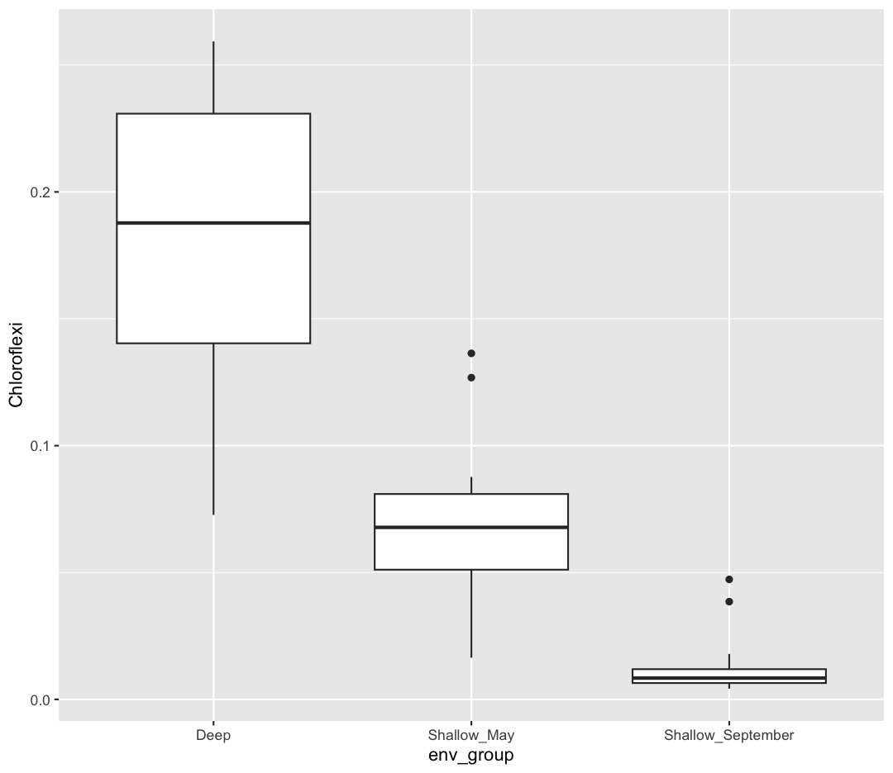
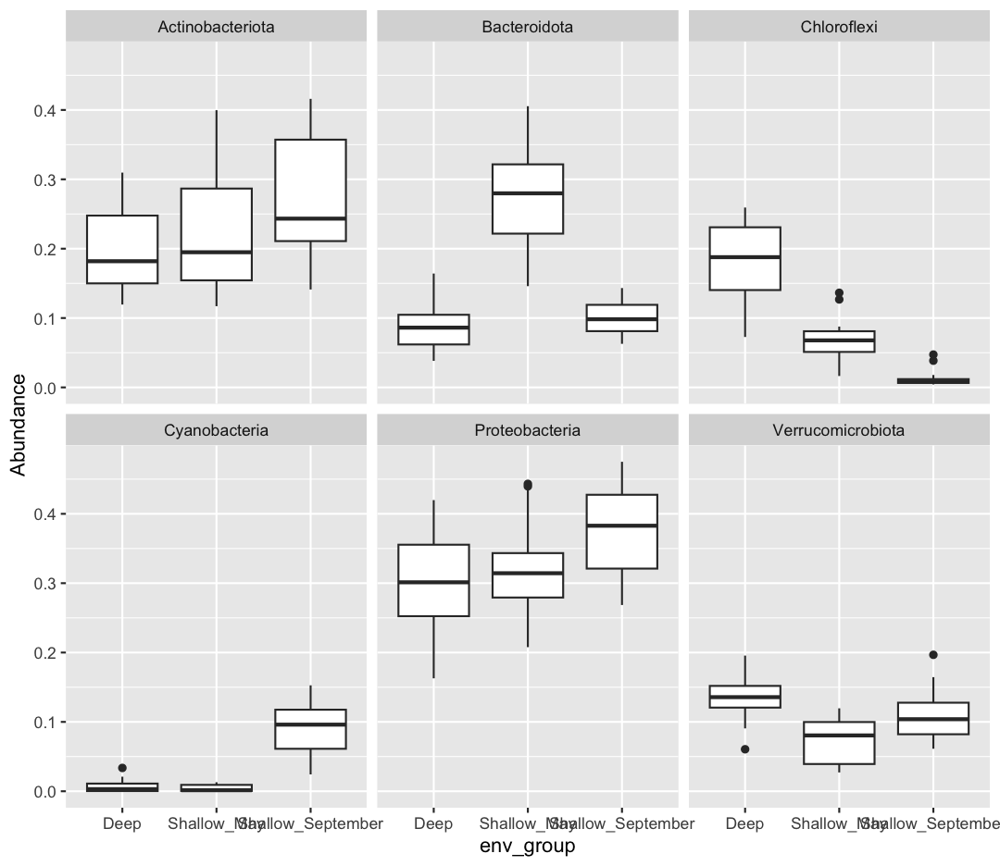

---
# Please do not edit this file directly; it is auto generated.
# Instead, please edit 05-r-markdown.md in _episodes_rmd/
title: "Writing Reports with R Markdown"
source: Rmd
teaching: 105
exercises: 30
questions:
- How can I make reproducible reports using R Markdown?
- How do I format text using Markdown?
objectives:
- To create a report in R Markdown that combines text, code, and figures.
- To use Markdown to format our report.
- To understand how to use R code chunks to include or hide code, figures, and messages.
- To be aware of the various report formats that can be rendered using R Markdown.
- 'To practice using the Unix Shell, and R through paired programming exercises. '
keypoints:
- R Markdown is an easy way to create a report that integrates text, code, and figures.
- 'Options such as `include` and `echo` determine what parts of an R code chunk are
  included in the R Markdown report. '
- R Markdown can render HTML, PDF, and Microsoft Word outputs.
---


### Contents
1. [What is R Markdown and why use it?](#why-use-r-markdown)
1. [Creating a reports directory](#creating-a-reports-directory)
1. [Creating an R Markdown file](#creating-an-r-markdown-file)
1. [Basic components of R Markdown](#basic-components-of-r-markdown)
    + [Header](#header)
    + [Code chunks](#code-chunks)
    + [Text](#text)
1. [Starting the report](#starting-the-report)
1. [Formatting](#formatting)
1. [Integrating it all together: Paired exercise](#integrating-it-all-together-paired-exercise)

Recall that our  goal is to generate a report which analyses how environmental conditions change microbial communities in Lake Ontario.

> ## Discussion
> How do you usually share data analyses with your collaborators? Add your usual workflow to the Etherpad.
{: .discussion}

## What is R Markdown and why use it?
_[Back to top](#contents)_

In R Markdown, you can incorporate ordinary text (ex. experimental methods, analysis and discussion of results) alongside code and figures! (Some people write entire manuscripts in R Markdown - if you're curious, talk to the Schmidt Lab!) This is useful for writing reproducible reports and publications, sharing work with collaborators, writing up homework, and keeping a bioinformatics notebook. Because the code is embedded in the document, the tables and figures are *reproducible*. Anyone can run the code and get the same results. If you find an error or want to add more to the report, you can just re-run the document and you'll have updated tables and figures! This concept of combining text and code is called "literate programming". To do this we use R Markdown, which combines Markdown (renders plain text) with R. You can output an html, PDF, or Word document that you can share with others. In fact, this webpage is an example of a rendered R markdown file!

(If you are familiar with Jupyter notebooks in the Python programming environment, R Markdown is  R's equivalent of a Jupyter notebook.)

> ## Other Options for Literate Programming
> There are many options for combining code and prose. If you are familiar with Jupyter notebooks in the Python programming environment, R Markdown is  R's equivalent of a Jupyter notebook. The company which manages RStudio, Posit, has also invested considerable energy in a new document type "Quarto", which they encourage users to adopt as it does not rely on an R install. There are many similarities between Quarto and RMarkdown, but the community of Quarto users (and history of troubleshooting support) is still smaller. Maybe someday soon, we will be teaching Quarto documents instead!
>
{: .callout}

## Creating a reports directory
_[Back to top](#contents)_

To get started, let's use the Unix Shell to create a directory within `ontario-report` called `reports` where we will write our reports.
First, open the Unix Shell and `cd` to `ontario-report`:

~~~
pwd
mkdir reports
~~~
{: .source}

~~~
/home/USERNAME/Desktop/ontario-report/reports/
~~~
{: .output}

Note that there is an option to use the terminal from R Studio (tab next to Console), but on Windows computers this terminal might not be a Unix Shell. 


## Creating an R Markdown file
_[Back to top](#contents)_

Now that we have a better understanding of what we can use R Markdown files for, let's start writing a report!

To create an R Markdown file:
- Open RStudio
- Go to File &rarr; New File &rarr; R Markdown
- Give your document a title, something like "A Report on Lake Ontario's Microbes" (Note: this is not the same as the file name - it's just a title that will appear at the top of your report)
- Keep the default output format as HTML.
- R Markdown files always end in `.Rmd`

> ## R Markdown Outputs
> The default output for an R Markdown report is HTML, but you can also use R Markdown to [output other report formats](https://rmarkdown.rstudio.com/lesson-9.html). For example, you can generate PDF reports using R Markdown, but you must [install some form of LaTeX](https://bookdown.org/yihui/rmarkdown-cookbook/install-latex.html) to do this.
>
{: .callout}


## Basic components of R Markdown
_[Back to top](#contents)_

### Header
_[Back to top](#contents)_

The first part is a *header* at the top of the file between the lines of `---`. This contains instructions for R to specify the type of document to be created and options to choose (ex., title, author, date). These are in the form of key-value pairs (`key: value`; YAML).

Here's an example:

```
---
title: 'Writing Reports with R Markdown'
author: "Augustus Pendleton"
date: "01/14/2025"
output: html_document
---
```

### Code chunks
_[Back to top](#contents)_

The next section is a *code chunk*, or embedded R code, that sets up options for all code chunks. Here is the default when you create a new R Markdown file:


~~~
```{r setup, include=FALSE}
knitr::opts_chunk$set(echo = TRUE)
```
~~~
{: .output}

All code chunks have this format:


~~~
```{r}
# Your code here
```
~~~
{: .output}

All of the code is enclosed in 3 back ticks and the `{r}` part indicates that it's a chunk of R code.

You can also include other information within the curly brackets to indicate different information about that code chunk.
For instance, the first code block is named "setup", and `include=FALSE` prevents code and results from showing up in the output file.

Inside the code chunk, you can put any R code that you want to run, and you can have as many code chunks as you want in your file.

As we mentioned above, in the first code chunk you set options for the entire file.
`echo = TRUE` means that you want your code to be shown in the output file. If you change this to `echo = FALSE`, then the code will be hidden and only the output of the code chunks will be seen in the output file.
There are also [many other options that you can change](https://rmarkdown.rstudio.com/lesson-3.html), but we won't go into those details in this workshop.


### Text
_[Back to top](#contents)_

Finally, you can include text in your R Markdown file.
This is any text or explanation you want to include, and it's formatted with Markdown.
We'll learn more about Markdown formatting soon!

## Starting the report
_[Back to top](#contents)_

Let's return to the new R Markdown file you created and delete everything below the setup code chunk. (That stuff is just examples and reminders of how to use R Markdown.)

Next, let's save our R markdown file to the `reports` directory.
You can do this by clicking the save icon in the top left or using <kbd>control</kbd> + <kbd>s</kbd> (<kbd>command</kbd> + <kbd>s</kbd>  on a Mac). Make sure to end the file with a ".Rmd" file extension.

There's one other thing that we need to do before we get started with our report.
To render our documents into html format, we can "knit" them in R Studio.
Usually, R Markdown renders documents from the directory where the document is saved (the location of the `.Rmd` file), but we want it to render from the main project directory where our `.Rproj` file is.
This is because that's where all of our relative paths are from and it's good practice to have all of your relative paths from the main project directory.
To change this default, click on the down arrow next to the "Knit" button at the top left of R Studio, go to "Knit Directory" and click "Project Directory".
Now it will assume all of your relative paths for reading and writing files are from the `ontario-report` directory, rather than the `reports` directory.

Now that we have that set up, let's start on the report!

We're going to use the code you generated yesterday to plot cell abundance and temperature to include in the report. Recall that we needed a couple R packages to generate these plots. We can create a new code chunk to load the needed packages. You could also include this in the previous setup chunk, it's up to your personal preference.


~~~
```{r packages}
library(tidyverse)
```
~~~
{: .output}

Now, in a real report this is when we would type out the background and purpose of our analysis to provide context to our readers. However, since writing is not a focus of this workshop we will avoid lengthy prose and stick to short descriptions. You can copy the following text  into your own report below the package code chunk.

```
This report was prepared to analyze environmental and microbial data from Lake Ontario. Our goal is to determine to how environmental variables like temperature affect the abundance of different Phyla of bacteria.
```

Now, since we want to show our results comparing cell abundance and temperature, we need to read in this data so we can regenerate our plot. We will add another code chunk to prepare the data.


~~~
```{r data}
sample_and_taxon <- read_csv("data/sample_and_taxon.csv")
```
~~~
{: .output}

Now that we have the data, we need to produce the plot. Let's create it!


~~~
```{r cell_vs_temp}
ggplot(data = sample_and_taxon) +
  aes(x = temperature, y = cells_per_ml/1000000, color=env_group) +
  geom_point() +
  labs(x = "Temperature (Celsius)", y = "Cells(million/ml)",
       title= "Are temperature and cell abundance linked?")
```
~~~
{: .output}

Now we can knit our document to see how our report looks! Use the <kbd>knit</kbd> button in the top left of the screen.


It's looking pretty good, but there seem to be a few extra bits that we don't need in the report. For example, the report shows that we load the tidyverse package and the accompanying messages.


To get rid of this, we can revise our packages code chunk by adding `include=FALSE` just like in the setup chunk to prevent code and messages in this chunk from showing up in our report.


~~~
```{r packages, include=FALSE}
library(tidyverse)
```
~~~
{: .output}

We can also see the code that was used to generate the plot. Depending on the purpose and audience for your report, you may want to include the code. If you don't want the code to appear, how can you prevent it? What happens if we add `include=FALSE` to the plot code chunk, too? Try rendering the R Markdown report with this change.


Oops! Now the plot doesn't show up in our report at all. This is because setting `include=FALSE` prevents anything in the code chunk from appearing in the report. Instead we can add `echo=FALSE`  to tell this code chunk that we don't want to see the code but just the output.


~~~
```{r cell_vs_temp, echo = FALSE}
ggplot(data = sample_and_taxon) +
  aes(x = temperature, y = cells_per_ml/1000000, color=env_group) +
  geom_point() +
  labs(x = "Temperature (Celsius)", y = "Cells(million/ml)",
       title= "Are temperature and cell abundance linked?")
```
~~~
{: .output}

When we knit this again, our plot is back!


Before we finalize our report, let's look at a few other cool features. Sometimes, you want to describe your data or results (like our plot) to the audience in text but the data and results may still change as you work things out. R Markdown offers an easy way to do this dynamically, so that the text updates as your data or results change. Here is how to do this.

First, let's create a code chunk that summarizes features of our data that we can use to describe our plot to  our audience. Note that we set `include=FALSE` because we only want this step to happen in the background. For our purposes, we will calculate how many samples were included in the analysis, as well as the minimum and maximum temperature values:


~~~
```{r data_summary, include=FALSE}
nSamples <- sample_and_taxon %>%
  select(sample_id) %>%
  n_distinct()

minTemp <- sample_and_taxon %>%
  summarise(round(min(temperature))) %>%
  pull()

maxTemp <- sample_and_taxon %>%
  summarise(round(max(temperature))) %>%
  pull()
```
~~~
{: .output}

Now, all we need to do is reference the values we just computed to describe our
plot. To do this, we enclose each value in one set of backticks 
(`` `r some_R_variable_name ` ``), while the ``r`` part once again
indicates that it's a chunk of R code. When we knit our report, R will
automatically fill in the values we just created in the above code chunk. Note
that R will automatically update these values every time our data might change
(if we were to decide to drop or add countries to this  analysis, for example).

```
The above plot shows the relationship between cell abundance and temperature for a total of `r nSamples ` samples. For this set of samples, temperature ranged from a minimum of `r minTemp`°C
to a maximum `r maxTemp`°C.
```
{: .code}

In addition to reporting specific values in the text, we may also want to show a table of values. With R Markdown there are multiple ways to product tables. One way to generate smaller tables is manually. Using a special format we can generate a table in our output. Note that this does not get generated in a code chunk because it is markdown formatting not R code.

```
|HEADER 1|HEADER 2|
|-------------|-------------|
|row 1, column1|row 1, column 2|
|row 2, column1|row 2, column 2|
```
Columns are separated by the pipe key <kbd>|</kbd> located above <kbd>Enter</kbd> on the keyboard. The dashes distinguish the header row from the rest of the table. This header could be a name for each column or a header for the whole table. Now that we know the basic structure we can fill in our table. This is how we could present the same numbers from the previous paragraph as a table instead, again using in-line code.
When we knit the report again, the code above will render like this:


Here's the text that we need to include to create a summary table of our data:


~~~

|Summary of Data|
|------|------|
|Number of Samples|`r nSamples`|
|Minimum Temperature|`r minTemp`|
|Maximum Temperature|`r maxTemp`|
~~~
{: .output}


This will render like this:


This is useful if we are reporting a few values, but can get tedious for larger tables. Another way we can add tables to our reports is using an R function called `kable()`. Since this is an R function, we will use it within a code chunk. We can give the `kable()` function a data table and it will format it to a nice looking table in the report. For example, we could use the following code to generate a table of all the Deep samples. The rendered version should look almost exactly as it does on this webpage. 


~~~
# load library
library(knitr)

# print kable
sample_and_taxon %>%
  filter(env_group == "Deep") %>%
  select(sample_id, env_group, cells_per_ml, temperature) %>%
  kable()
~~~
{: .language-r}

<table>
 <thead>
  <tr>
   <th style="text-align:left;"> sample_id </th>
   <th style="text-align:left;"> env_group </th>
   <th style="text-align:right;"> cells_per_ml </th>
   <th style="text-align:right;"> temperature </th>
  </tr>
 </thead>
<tbody>
  <tr>
   <td style="text-align:left;"> May_12_B </td>
   <td style="text-align:left;"> Deep </td>
   <td style="text-align:right;"> 2058864 </td>
   <td style="text-align:right;"> 4.07380 </td>
  </tr>
  <tr>
   <td style="text-align:left;"> May_29_B </td>
   <td style="text-align:left;"> Deep </td>
   <td style="text-align:right;"> 2153086 </td>
   <td style="text-align:right;"> 4.66955 </td>
  </tr>
  <tr>
   <td style="text-align:left;"> May_33_B </td>
   <td style="text-align:left;"> Deep </td>
   <td style="text-align:right;"> 2293177 </td>
   <td style="text-align:right;"> 3.87050 </td>
  </tr>
  <tr>
   <td style="text-align:left;"> May_41_B </td>
   <td style="text-align:left;"> Deep </td>
   <td style="text-align:right;"> 2422141 </td>
   <td style="text-align:right;"> 3.76370 </td>
  </tr>
  <tr>
   <td style="text-align:left;"> May_55_B </td>
   <td style="text-align:left;"> Deep </td>
   <td style="text-align:right;"> 1847686 </td>
   <td style="text-align:right;"> 3.66830 </td>
  </tr>
  <tr>
   <td style="text-align:left;"> May_64_B </td>
   <td style="text-align:left;"> Deep </td>
   <td style="text-align:right;"> 1631065 </td>
   <td style="text-align:right;"> 3.67740 </td>
  </tr>
  <tr>
   <td style="text-align:left;"> May_74_B </td>
   <td style="text-align:left;"> Deep </td>
   <td style="text-align:right;"> 2270042 </td>
   <td style="text-align:right;"> 4.86530 </td>
  </tr>
  <tr>
   <td style="text-align:left;"> September_12_B </td>
   <td style="text-align:left;"> Deep </td>
   <td style="text-align:right;"> 1703592 </td>
   <td style="text-align:right;"> 4.19650 </td>
  </tr>
  <tr>
   <td style="text-align:left;"> September_12_M </td>
   <td style="text-align:left;"> Deep </td>
   <td style="text-align:right;"> 2304545 </td>
   <td style="text-align:right;"> 4.75550 </td>
  </tr>
  <tr>
   <td style="text-align:left;"> September_33_B </td>
   <td style="text-align:left;"> Deep </td>
   <td style="text-align:right;"> 1246414 </td>
   <td style="text-align:right;"> 3.97670 </td>
  </tr>
  <tr>
   <td style="text-align:left;"> September_33_M </td>
   <td style="text-align:left;"> Deep </td>
   <td style="text-align:right;"> 1793411 </td>
   <td style="text-align:right;"> 4.16960 </td>
  </tr>
  <tr>
   <td style="text-align:left;"> September_38_B </td>
   <td style="text-align:left;"> Deep </td>
   <td style="text-align:right;"> 1783244 </td>
   <td style="text-align:right;"> 5.26790 </td>
  </tr>
  <tr>
   <td style="text-align:left;"> September_38_E </td>
   <td style="text-align:left;"> Deep </td>
   <td style="text-align:right;"> 1989859 </td>
   <td style="text-align:right;"> 6.83795 </td>
  </tr>
  <tr>
   <td style="text-align:left;"> September_41_B </td>
   <td style="text-align:left;"> Deep </td>
   <td style="text-align:right;"> 1394350 </td>
   <td style="text-align:right;"> 3.83100 </td>
  </tr>
  <tr>
   <td style="text-align:left;"> September_41_M </td>
   <td style="text-align:left;"> Deep </td>
   <td style="text-align:right;"> 2067910 </td>
   <td style="text-align:right;"> 3.93275 </td>
  </tr>
  <tr>
   <td style="text-align:left;"> September_55_B </td>
   <td style="text-align:left;"> Deep </td>
   <td style="text-align:right;"> 1594241 </td>
   <td style="text-align:right;"> 3.77870 </td>
  </tr>
  <tr>
   <td style="text-align:left;"> September_55_M </td>
   <td style="text-align:left;"> Deep </td>
   <td style="text-align:right;"> 2008431 </td>
   <td style="text-align:right;"> 3.92295 </td>
  </tr>
  <tr>
   <td style="text-align:left;"> September_64_B </td>
   <td style="text-align:left;"> Deep </td>
   <td style="text-align:right;"> 1459993 </td>
   <td style="text-align:right;"> 3.76020 </td>
  </tr>
  <tr>
   <td style="text-align:left;"> September_64_M </td>
   <td style="text-align:left;"> Deep </td>
   <td style="text-align:right;"> 1852089 </td>
   <td style="text-align:right;"> 3.98550 </td>
  </tr>
  <tr>
   <td style="text-align:left;"> September_717_B </td>
   <td style="text-align:left;"> Deep </td>
   <td style="text-align:right;"> 1575429 </td>
   <td style="text-align:right;"> 4.02260 </td>
  </tr>
  <tr>
   <td style="text-align:left;"> September_717_M </td>
   <td style="text-align:left;"> Deep </td>
   <td style="text-align:right;"> 2024282 </td>
   <td style="text-align:right;"> 4.85345 </td>
  </tr>
</tbody>
</table>


## Formatting
_[Back to top](#contents)_

We now know how to create a report with R Markdown. Maybe we also want to format the report a little bit to structure our thought process in a useful way (e.g., sections) and make it visually appealing?
Markdown is a very simple programming language when it comes to syntax.
Let's try to figure out some syntax together. Suppose we wanted to create sections in our report.

> ## R Markdown headers
> Try googling how to create sections by using headers and subheaders using R Markdown. What do you find?
>
> > ## Solution
> > We can easily create headers and subheaders by using the `#` pound/hash sign. Our main headers have one `#` (e.g. `# Main Header Here`) and to create subheaders we add additinal `#`s (e.g. `## First subheader` and `### Second subheader`)
> {: .solution}
{: .challenge}

OK, now that we know how to make headers, let's practice some more Markdown syntax.

> ## R Markdown syntax
> Go ahead and do some online searches on how to do the following:
> * create a bullet point list with three items
> * as the first item, write the name of your currently favorite programming language in bold
> * as the second item, write  the name of a function you have so far found most useful in italics
> * as the third item, write one thing you want to learn next on your programming journey in bold and italics
> * turn your bullet point list into a numbered list
> * create a fourth list item and find an online guide and/or cheat sheet for basic Markdown syntax, write its name down here and hyperlink its url
>
> > ## Solution
> > [This link](https://rmarkdown.rstudio.com/authoring_basics.html) has some helpful basic R Markdown syntax.
> {: .solution}
{: .challenge}

> ## Using the "Visual" view for easy formatting
> 
> In newer versions of RStudio, we can switch to the "Visual" view when editing our documents. This makes the experience much more similar to writing in software like Microsoft Word or Google Docs. We can use formatting tools (like bolding and italicizing), insert pictures, and create tables without manually typing out the markdown syntax. The best part? If you then switch back to the "Source" view, you can see the markdown syntax RStudio has automatically created for you.
{: .callout}

## Integrating it all together: Make your own report!
_[Back to top](#contents)_

You've learned so much in the past two days - how to use the Unix Shell to move around your computer, how to make pretty plots and do data analysis in R, and how to incorporate it all into a report which you can share with Collaborators via Github! Don't worry - if you have questions, the instructor and helpers are here to help you out!

1. Make a new R Markdown file.
1. Give it an informative title.
1. Delete all the unnecessary Markdown and R code (everything below the setup R chunk).
1. Save it to the `reports` directory as LASTNAME_Ontario_Report.Rmd

Work through the exercises below, adding code chunks to analyze and plot the data, and prose to explain what you're doing. Make sure to knit as you go, to make sure everything is working. 

The exercises below give you some ideas of directions to pursue. These are nice exercises because we have the solutions saved. However, you're welcome to branch out as well! Maybe you have your own hypotheses you'd like to test. Maybe you want to explore a new type of ggplot. Perhaps you want to run some statistical tests.  

Just remember to use a combination of prose (writing) and code to document the goals, process, and outputs of your analysis in your RMarkdown report. 

Once you're done, *add* your report to your Git repo, *commit* those changes, and *push* those changes to Github. If you feel comfortable, post a link to the repo on the Etherpad, and [change your repo's settings to **Public**](https://docs.github.com/en/repositories/managing-your-repositorys-settings-and-features/managing-repository-settings/setting-repository-visibility#changing-a-repositorys-visibility), so that others in the class can admire what you've accomplished!

### Bonus Exercises
_[Back to top](#contents)_

[1] The very first step is to read in the sample_and_taxon dataset, so do that first! Also load the `tidyverse` package.

> ## Solution
> 
> ~~~
> library(tidyverse)
> sample_and_taxon <- read_csv('data/sample_and_taxon.csv')
> ~~~
> {: .language-r}
> 
> 
> 
> ~~~
> Rows: 71 Columns: 15
> ── Column specification ───────────────────────────────────────────────────────────────────────────────────────────────
> Delimiter: ","
> chr  (2): sample_id, env_group
> dbl (13): depth, cells_per_ml, temperature, total_nitrogen, total_phosphorus...
> 
> ℹ Use `spec()` to retrieve the full column specification for this data.
> ℹ Specify the column types or set `show_col_types = FALSE` to quiet this message.
> ~~~
> {: .output}
{: .solution}

#### Investigating nutrients and cell density
_[Back to top](#contents)_

[2] Make a scatter plot of total_nitrogen vs. cells_per_ml, separated into a plot for each env_group. **Hint:** you can use `facet_wrap(~column_name)` to separate into different plots based on that column.

> ## Solution
> 
> ~~~
> ggplot(sample_and_taxon, aes(x=total_nitrogen,y=cells_per_ml)) +
> geom_point() +
> facet_wrap(~env_group)
> ~~~
> {: .language-r}
> 
> 
{: .solution}

[3] It seems like there is an outlier in Shallow_May with very high nitrogen levels. What is this sample? Use a combination of `filter` and `arrange` to find out.

> ## Solution
> 
> ~~~
> sample_and_taxon %>% 
>  filter(env_group == "Shallow_May") %>% 
>  arrange(desc(total_nitrogen))
> ~~~
> {: .language-r}
> 
> 
> 
> ~~~
> # A tibble: 25 × 15
>    sample_id env_group   depth cells_per_ml temperature total_nitrogen
>    <chr>     <chr>       <dbl>        <dbl>       <dbl>          <dbl>
>  1 May_8_E   Shallow_May     5     4578830.        8.43            640
>  2 May_29_M  Shallow_May    19     2566156.        5.69            539
>  3 May_29_E  Shallow_May     5     3124920.        5.97            521
>  4 May_33_M  Shallow_May    20     3114433.        4.53            515
>  5 May_43_E  Shallow_May     5     2787020.        5.88            499
>  6 May_17_E  Shallow_May     5     3738681.        5.99            492
>  7 May_66_E  Shallow_May     5     5262156.       12.3             489
>  8 May_35_B  Shallow_May    27     3066162.        6.57            479
>  9 May_48_B  Shallow_May    35     2300782.        4.79            477
> 10 May_717_E Shallow_May     5     4197941.       10.2             477
> # ℹ 15 more rows
> # ℹ 9 more variables: total_phosphorus <dbl>, diss_org_carbon <dbl>,
> #   chlorophyll <dbl>, Proteobacteria <dbl>, Actinobacteriota <dbl>,
> #   Bacteroidota <dbl>, Chloroflexi <dbl>, Verrucomicrobiota <dbl>,
> #   Cyanobacteria <dbl>
> ~~~
> {: .output}
{: .solution}

[4] Where was this sample again? Let's look at a map:


Wow! This sample is right outside of Toronto.

We also see that Shallow September has four strange points, with high nitrogen and low cell counts. Let's use a new geom, `geom_text` to figure out what those samples are (this might take some googling!). Also, let's use `filter` to only plot samples from "Shallow_September".

> ## Solution
> 
> ~~~
> sample_and_taxon %>%
>   filter(env_group == "Shallow_September") %>%
>   ggplot(aes(x = total_nitrogen, y = cells_per_ml)) + 
>   geom_text(aes(label = sample_id))
> ~~~
> {: .language-r}
> 
> 
{: .solution}

Interesting...these are mostly from Station 35. I wonder why these stations have such high nitrogen and such low cell abundances? 

> ## Solution
> 
> Here, I show surface temperatures across the lake in September. Station 35 was on the edge an upwelling event, where cold, nutrient rich water is pulled to the surface of the lake! Stn. 38, which was smack dab in the upwelling itself, was so similar to deep samples that its env_group is "Deep" rather than "Shallow_September".
{: .solution}

If you want to investigate this phenomenon further, spend time analyzing the relative composition of Phyla in these upwelling stations compared to the rest of Shallow_September. If you want to go further, you can use the buoy_data from the Niagara and South Shore buoys to see if you can detect when this upwelling event began.

#### Comparing Dominant Phylum Across Environmental Groups
_[Back to top](#contents)_

[6] We want to know which Phyla tend to live in which environments. Previously, we focused on Chloroflexi, and found it preferred Deep environments. What if we want to look at the relative abundances of all our Phyla between env_groups at once?

First, let's remind ourselves how we looked at Chloroflexi across env_groups. Make a boxplot with env_group on the x-axis, and Chloroflexi relative abundance on the y axis.

> ## Solution
> 
> ~~~
> sample_and_taxon %>%
>   ggplot(aes(x = env_group, y = Chloroflexi)) + 
>   geom_boxplot()
> ~~~
> {: .language-r}
> 
> 
{: .solution}

[7] Now, we want to analyze multiple Phyla at once. Because our taxa abundances are in wide format, we can't use multiple Phyla in a single ggplot. As such, we will need to convert our data to long format. Using `pivot_longer`, convert the columns containing our Phyla abundances from wide to long.

> ## Solution
> 
> ~~~
> sample_and_taxon %>%
>   pivot_longer(cols = Proteobacteria:Cyanobacteria, names_to = "Phylum", values_to = "Abundance")
> ~~~
> {: .language-r}
> 
> 
> 
> ~~~
> # A tibble: 426 × 11
>    sample_id env_group   depth cells_per_ml temperature total_nitrogen
>    <chr>     <chr>       <dbl>        <dbl>       <dbl>          <dbl>
>  1 May_12_B  Deep         103.     2058864.        4.07            465
>  2 May_12_B  Deep         103.     2058864.        4.07            465
>  3 May_12_B  Deep         103.     2058864.        4.07            465
>  4 May_12_B  Deep         103.     2058864.        4.07            465
>  5 May_12_B  Deep         103.     2058864.        4.07            465
>  6 May_12_B  Deep         103.     2058864.        4.07            465
>  7 May_12_E  Shallow_May    5      4696827.        7.01            465
>  8 May_12_E  Shallow_May    5      4696827.        7.01            465
>  9 May_12_E  Shallow_May    5      4696827.        7.01            465
> 10 May_12_E  Shallow_May    5      4696827.        7.01            465
> # ℹ 416 more rows
> # ℹ 5 more variables: total_phosphorus <dbl>, diss_org_carbon <dbl>,
> #   chlorophyll <dbl>, Phylum <chr>, Abundance <dbl>
> ~~~
> {: .output}
{: .solution}

You can see that we've now made size rows per sample, one for each Phylum. This does mean that our metadata has been duplicated, which is okay right now.

Now, our data is in the correct format for plotting with ggplot. In the end, we want a plot that shows, for each env_group, the relative abundance of each Phylum. There are actually many plotting styles we could use to answer that question! We'll try out three. 

[8] Pipe your long dataframe into a boxplot with env_group on the x-axis, and Abundance on the y-axis. Use fill to differentiate different Phyla

> ## Solution
> 
> ~~~
> sample_and_taxon %>%
>   pivot_longer(cols = Proteobacteria:Cyanobacteria, names_to = "Phylum", values_to = "Abundance") %>%
>   ggplot(aes(x = env_group, y = Abundance, fill = Phylum)) + 
>   geom_boxplot()
> ~~~
> {: .language-r}
> 
> 
{: .solution}

[9] Okay, what does this plot tell us? Make sure to write a quick summary in your report. Next, make a new plot, where Phylum is now on the x-axis, and the fill is determined by the env_group.

> ## Solution
> 
> ~~~
> sample_and_taxon %>%
>   pivot_longer(cols = Proteobacteria:Cyanobacteria, names_to = "Phylum", values_to = "Abundance") %>%
>   ggplot(aes(x = Phylum, y = Abundance, fill = env_group)) + 
>   geom_boxplot()
> ~~~
> {: .language-r}
> 
> 
{: .solution}

[10] Which do you prefer? Which do you feel is easier to understand? Finally, let's use faceting, rather than fill, to separate out Phyla

> ## Solution
> 
> ~~~
> sample_and_taxon %>%
>   pivot_longer(cols = Proteobacteria:Cyanobacteria, names_to = "Phylum", values_to = "Abundance") %>%
>   ggplot(aes(x = env_group, y = Abundance)) + 
>   geom_boxplot() + 
>   facet_wrap(~Phylum)
> ~~~
> {: .language-r}
> 
> 
{: .solution}

If you want to investigate this dataset further, consider changing the x-axis to a continuous variable, like temperature, rather than the categorical env_group. Can you find associations between different environmental conditions and the abundance of specific taxa?

### Bonus-Bonus: Let your creativity shine!

If you've gotten this far, feel free to let your creativity shine. Consider:

1. Make your plots beautiful and professional:
 - Alter axis labels
 - Use `theme` to change the font size of axis and legend text
 - Using or creating a beautiful palette from a new package
2. Render your report in different formats, including pdf or docx
3. Find a partner and use Github to collaborate on a shared RMarkdown document.
