---
# Please do not edit this file directly; it is auto generated.
# Instead, please edit 06-r-statistics.md in _episodes_rmd/
title: "Basic Statistics in R"
source: Rmd
teaching: 105
exercises: 30
questions:
- How can I use R to run statistical tests?
- How can I add statistics to plots?
objectives:
- To test differences in a numeric variable between two groups (e.g. t-test)
- To test differences in a numeric variable across multiple groups (e.g. ANOVAs and post-hoc tests)
- To generate a linear model between two numeric variables
- To add results of statistical tests to plots
keypoints:
- R comes pre-loaded with many statistical tests 
- Running tests in R is straightforward, but evaluating their output is *our* responsibility
editor_options: 
  chunk_output_type: console
---

### Contents
1. [How do you use statistics in your work?](#how-statistics)
1. [Limits of our lesson today](#limits)
1. [Two-Group Comparisons](#t-tests)
1. [Multi-Froup Comparisons](#anovas)
    + [The risks of multiple comparisons](#header)
    + [ANalysis Of VAriance](#code-chunks)
    + [Post-hoc Tests](#text)
    + [Non-parametric tests for multiple comparisons](#text)
1. [Correlations](#correlations)
1. [Linear Regression](#linear-regression)
1. [Bonus: Cleaning Stats Outputs](#cleaning-output)
1. [Integrating it all together!](#integrating-it-all-together)

## How do you use statistics in your work?
_[Back to top](#contents)_

We've now learned to clean our data, calculate summary statistics, and visualize trends, and combine these analyses into a shareable report. To finish our scientific report, we will also want to use statistical tests to estimate the significance the patterns we've observed in our data. R, from its inception, was designed to help scientists run statistical tests. This makes R a great tool to use for statistics!

> ## Discussion
> What statistical tests do you typically use when analyzing your data? Put them in the Etherpad and describe when you use them.
{: .discussion}

## Limits of our lesson today
_[Back to top](#contents)_

Unfortunately, we can't promise that you'll walk out this workshop as a statistics expert. Statistics, just like programming, is a massive field which takes years to learn and master. Every research problem will have unique statistical needs and analyses, and so we cannot cover them all. 

However, our goal in this section of the workshop is to demonstrate some of the most common statistical tests which biologists use in their work. We'll focus on *how* we run these tests, without spending time on the mathematical and conceptual bases of these tests. Remember, that *running* a test is almost always easier than **interpreting** a test. When in doubt, talk to your PI, another colleague, or book a consultation through the [Cornell Statistical Consulting Unit](https://cscu.cornell.edu/).

## Two-Group Comparisons
_[Back to top](#contents)_

We'll be using the same report which we started in our RMarkdown lesson. Please open this document and confirm that the Knit directory is set to "Project Directory".

Scroll to the bottom and make a new header (with two `##`) called "Two-Group Comparisons". 

Then, make a new code-chunk called `{r cells_vs_month}`.

First, let's visualize the comparison we plan on making. We want to test if the Phylum Bacteroidota is more abundant in Shallow May vs. Shallow September. Let's make a ggplot which looks at that comparison. Notice how I'm using pipes to include a filter command, followed by the ggplot itself. 

~~~
no_deep <- sample_and_taxon %>%
    filter(env_group != "Deep")

no_deep %>%
    ggplot(aes(x = env_group, y = Bacteroidota)) + 
    geom_boxplot()
~~~
{: .language-r}

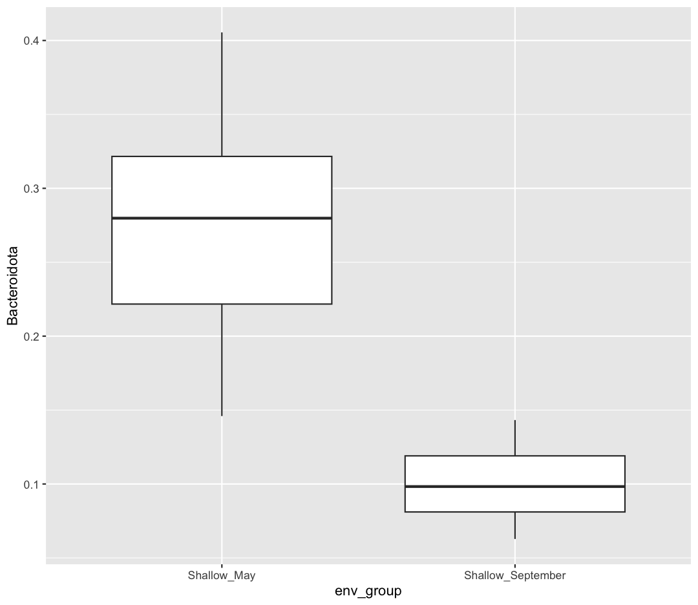

Just by eye, it does look like there are more Bacteroidota in May than there are in September! However, it's possible that the Bacteroidota counts look higher in May due to random chance. We can use a statistical test to determine how likely the difference we observed in Bacteroidota counts between May and September is due to chance versus a true difference in Bacteroidota abundances. 

When we are comparing the differences in the *mean of a numerical variable* between *two categorical variables*, we can use a t-test. The t-test is a type of hypothesis test. Here are the two hypotheses we'll test:

1. Null Hypothesis: There are no true differences between Bacteroidota counts in May and September - on average, Bacteroidota abundances are the same between months

2. Alternative Hypothesis: There *is* a difference in Bacteroidota abundances between May and September. 

The t-test will look at how different the mean Bacteroidota counts are between May and September. It will also consider how much variability there was in our data within each group. With these two parameters in mind, the t-test will produce a **p-value**, which is the estimated probability that we would observe the difference we did **if the null hypothesis was true**. If the p-value is sufficiently low, that means our data indicates the null hypothesis is likely incorrect. As such, we can reject the null hypothesis and conclude the alternative hypothesis is true - there really is a difference in Bacteroidota abundances between May and September. 

Let's run our first t-test. Let's make a new chunk called `{r t-test}`

~~~
t.test(Bacteroidota ~ env_group, data = no_deep)
~~~
{: .language-r}

~~~

	Welch Two Sample t-test

data:  Bacteroidota by env_group
t = 12.888, df = 29.936, p-value = 9.503e-14
alternative hypothesis: true difference in means between group Shallow_May and group Shallow_September is not equal to 0
95 percent confidence interval:
 0.1514943 0.2085541
sample estimates:
      mean in group Shallow_May mean in group Shallow_September 
                      0.2802874                       0.1002632 
~~~
{: .output}

There is a lot of output here! The main point we'll focus on today is the p-value: 9.503e-14, or 9.503x10^-14^. In this case, the p-value is very small. People typically set their threshold for "significant" p-values at 0.05, though this varies depending on the field and the question. In this case, we'll reject the null hypothesis. We might now say "The relative abundance of Bacteroidota is *significantly* higher in Shallow_May compared to Shallow_September."

All statistical tests come with their own important assumptions, which need to be met for us to trust the outputs of the test. While we won't have time to cover those assumptions, we reiterate that you are responsible for checking the assumptions of your statistical tests! 

A t-test is what's called a "parametric" test, which makes several assumptions about the distribution of our data. Other tests, called "non-parametric" tests, make fewer assumptions about the population from which we sampled our data, and so may be preferred for some datasets. To demonstrate how to run a common non-parametric test for two-sample tests, we'll run a "Two-Sample Wilcoxon Test" (this test is also called a "Mann-Whitney Test". Moving forward, we'll trust you to create and name your own R chunks. 

~~~
wilcox.test(Bacteroidota ~ env_group, data = no_deep)
~~~
{: .language-r}

~~~

	Wilcoxon rank sum exact test

data:  Bacteroidota by env_group
W = 625, p-value = 1.582e-14
alternative hypothesis: true location shift is not equal to 0
~~~
{: .output}

Notice the similarities in how we specify this test - we use the same formula notation and data argument as in our t-test. You can also see that our p-value is larger, though still very small. Because they rely on fewer assumptions, non-parametric tests will generally be "less powerful", which means their p-values will be higher compared to parametric tests. What type of test is correct for your data is an important consideration. When in doubt, consult your PI or a statistician.

## Multi-Group Comparisons
_[Back to top](#contents)_

Our t-test and Wilcoxon test allowed us to compare the means of a numerical variable between two groups. But what if we have more than two groups? We'll need to use different tests when comparing means across categorical variables which have three or more groups. Let's say I now want to test the abundance of Bacteroidota across all three env_groups: Deep, Shallow May, and Shallow September.

### The risks of multiple comparisons

Why does it matter if we have multiple groups? Can't we just run t-tests between each group and see which t-tests are significant?

There is nothing, from a practical standpoint, that prevents us from running a t-test between each pair of environmental groups. These are called "pairwise t-tests." This would result in us running three t-tests: one comparing Deep to Shallow May, one comparing Deep to Shallow September, and one comparing Shallow May to Shallow September. If I had four groups, I would instead need to run six t-tests, and at five groups, I'm now running ten t-tests. The number of tests we're running increases rapidly as we add groups to our categorical variable. We call all these pairs of tests "multiple comparisons."

The danger of multiple comparisons is that they increase our chances of incorrectly rejecting the null hypothesis, or detecting a significant difference when we shouldn't have. Recall that we typically set our p-value threshold at 0.05. Now let's say we run 20 unique t-tests, all of which had a p-value of 0.05. With these assumptions we'd reject the null hypothesis for all of those tests - even though one of them was likely due to pure chance! Our liability to commit this type of error increases as we run more comparisons. 

Part of the reason multiple comparisons can be risky is that each test is only looking at a subset of the data and making conclusions only within that subset. We can help mitigate the risk from multiple comparisons by first running a test that considers **all** of our observations, before running pairwise tests. 

### ANalysis Of VAriance (ANOVA)

One such test is called an Analysis of Variance, or "ANOVA". It will consider all the observations across all our three groups, and estimate whether there is at least *one* significant difference in means between our three groups. Let's first plot the comparison we plan to make. 

~~~
sample_and_taxon %>%
    ggplot() + 
    aes(x = env_group, y = Bacteroidota) + 
    geom_boxplot()
~~~
{: .language-r}

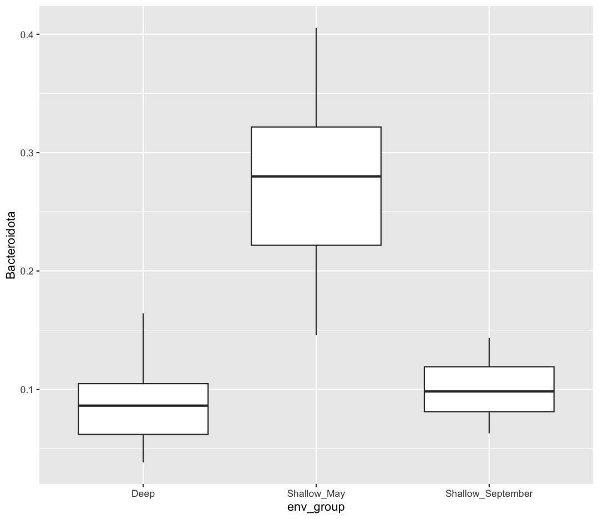

It looks like Shallow May is highest, but I'm not sure whether Deep will be significantly different from Shallow September. 

Now let's run an ANOVA, which will look at all our data and help us decide whether it's worthwhile running pairwise comparisons. An ANOVA is another type of hypothesis test, which is testing these hypotheses:

1. Null Hypothesis: There are no true differences between Bacteroidota abundance between our three env_groups

2. Alternative Hypothesis: There *is* a difference in Bacteroidota abundances between at least two of our env_groups 

~~~
bact_anova <- aov(Bacteroidota ~ env_group, data = sample_and_taxon)

summary(bact_anova)
~~~
{: .language-r}

~~~
            Df Sum Sq Mean Sq F value Pr(>F)    
env_group    2 0.5639 0.28197   139.4 <2e-16 ***
Residuals   68 0.1375 0.00202                   
---
Signif. codes:  0 '***' 0.001 '**' 0.01 '*' 0.05 '.' 0.1 ' ' 1
~~~
{: .output}

The key piece of this output is the p-value, which is given underneath "Pr(>F)": <2e-16. This is the smallest number that R is able to calculate, and means our p-value is very small. Hence, we can reject the null hypothesis and conclude that the means of *at least* two groups are different, though we don't yet know which ones. This test result gives us confidence to now run pairwise comparisons to find out which groups are significantly different. We call these "post-hoc" tests (latin for "after this") because you should only run them *after* a significant result from an ANOVA. If our p-value from the ANOVA was greater than 0.05, we would fail to reject the null hypothesis, and continue onto any pairwise tests.

### Post-hoc Tests

The test we'll use today is called a Tukey HSD test. To run this test, we'll use the `bact_anova` object we created. 

~~~
TukeyHSD(bact_anova)
~~~
{: .language-r}

~~~
  Tukey multiple comparisons of means
    95% family-wise confidence level

Fit: aov(formula = Bacteroidota ~ env_group, data = sample_and_taxon)

$env_group
                                     diff         lwr         upr     p adj
Shallow_May-Deep               0.19364869  0.16175009  0.22554730 0.0000000
Shallow_September-Deep         0.01362447 -0.01827413  0.04552308 0.5647669
Shallow_September-Shallow_May -0.18002422 -0.21050439 -0.14954405 0.0000000
~~~
{: .output}

This output shows each comparison on the far left, and the p-value for that pairwise test on the far right, rounded to seven decimals. We see significant differences between Shallow_May and Deep, and Shallow_May and Shallow_September. However, we see that there is no significant difference between Shallow_September and Deep. 

### Non-parametric tests for multiple comparisons

There are similar non-parametric tests for comparing differences across multiple groups. In this case, we'll use a Kruskal-Wallis test instead of an ANOVA, and a Dunn's test instead of a Tukey HSD test. To run a Dunn's test, we need to install the `FSA` package. 

~~~
kruskal.test(Bacteroidota ~ env_group, data = sample_and_taxon)
~~~
{: .language-r}

~~~

	Kruskal-Wallis rank sum test

data:  Bacteroidota by env_group
Kruskal-Wallis chi-squared = 48.968, df = 2, p-value = 2.326e-11
~~~
{: .output}

~~~
# install.packages("FSA")

FSA::dunnTest(Bacteroidota ~ env_group, data = sample_and_taxon)
~~~
{: .language-r}

~~~
Warning: env_group was coerced to a factor.
~~~
{: .warning}

~~~
Dunn (1964) Kruskal-Wallis multiple comparison
~~~
{: .output}

~~~
  p-values adjusted with the Holm method.
~~~
{: .output}

~~~
                       Comparison         Z      P.unadj        P.adj
1              Deep - Shallow_May -6.400360 1.550106e-10 4.650319e-10
2        Deep - Shallow_September -1.103672 2.697356e-01 2.697356e-01
3 Shallow_May - Shallow_September  5.543177 2.970329e-08 5.940658e-08
~~~
{: .output}

While the outputs differ slightly, our conclusions (that there are significant differences between at least two groups, and then those groups are Shallow May compared to Deep and Shallow September) remain the same. 

> ## Adjusted p-values
> 
> You probably noticed that results from both the Tukey HSD test and Dunn's test included either a "p adj" or "P.adj", which stands for "adjusted p-value". Because making multiple comparisons means we are at a greater risk of incorrectly assuming a significant difference, these tests adjust our p-values to be more strict, to help prevent erroneous conclusions. These means they inflate the p-values, so that they need to have started smaller in order to still fall under our significance threshold (typically 0.05). [There are many ways to adjust p-values](http://www-stat.wharton.upenn.edu/~steele/Courses/956/Resource/MultipleComparision/Writght92.pdf), some of which are more conservative and others which are more confident. What adjustment to use is, like all of the tests we run today, conditional on your data, your research question, and the norms in your field.
{: .callout}

## Correlations
_[Back to top](#contents)_

So far, we've tested the relationship between a numerical variable (Bacteroidota counts) across a categorical variable (env_group). But what if we want to test the association between two numerical variables? One way for us to do this is to calculate the *correlation* between the values in each of these variables. For instance, we've previously visualized the fact that cell abundance tends to increase with temperature. Correlation is asking - when the temperature increases, does the cell abundance also increase? 

Let's start by visualizing the comparison we intend to make:

~~~
sample_and_taxon %>%
    ggplot() +
    aes(x = temperature, y = cells_per_ml) + 
    geom_point()
~~~
{: .language-r}

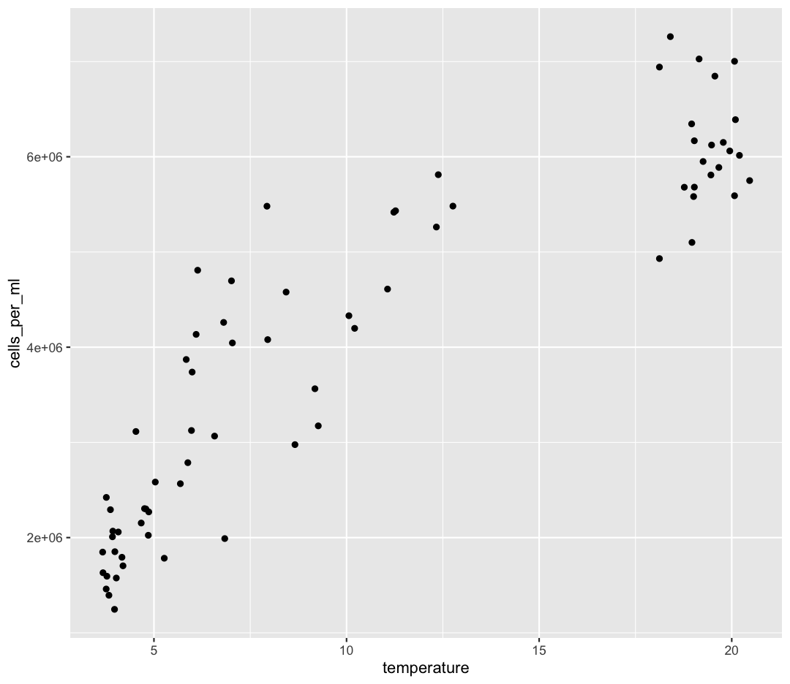

Let's run a correlation test first, and then discuss the interpretation. We'll use the function `cor.test`, and provide it two columns from our dataframe between which we want to calculate the correlation.

~~~
cor.test(sample_and_taxon$cells_per_ml, sample_and_taxon$temperature)
~~~
{: .language-r}

~~~

	Pearson's product-moment correlation

data:  sample_and_taxon$cells_per_ml and sample_and_taxon$temperature
t = 17.276, df = 69, p-value < 2.2e-16
alternative hypothesis: true correlation is not equal to 0
95 percent confidence interval:
 0.8457586 0.9374310
sample estimates:
      cor 
0.9012324 
~~~
{: .output}

This function actually did two things for us. First, it calculated the Pearson's correlation coefficient. This can be found underneath "cor", and is 0.9012324. The correlation coefficient ranges from -1 up to 1. When the correlation coefficient is 1, the two variables are perfectly correlated: when variable one increases, variable two always increases proportionally. We would say these two variables also follow a perfect, positive, linear relationship. When the correlation coefficient is -1, the variables follow a perfect, negative, linear relationship, where an increase in variable one is always linked to a proportional decrease in variable two. Finally, a correlation coefficient of 0 means there is no correlation between our variables. An increase in variable one isn't tied to any predictable increase or decrease in variable two. 

Our correlation coefficient (0.9012324) is close to one, supporting our previous conclusions that as temperature increase, cell abundances also consistently increase. 

The `cor.test` function did another step that was helpful, in that it ran a hypothesis test on the significance of this correlation coefficient. It was testing two hypotheses:

1. Null Hypothesis: The true correlation coefficient is 0: the observed correlation was the result of random chance

2. Alternative Hypothesis: There is a non-zero correlation between cell abundance and temperature 

Our p-value for this test was as small as R can render: 2.2e-16. As such, we can reject our null hypothesis, and conclude that there is a significant correlation between cell abundance and temperature. 

If you are married to formula notation, we can also run our `cor.test` using a formula:

~~~
cor.test(~ cells_per_ml + temperature, data = sample_and_taxon)
~~~
{: .language-r}

~~~

	Pearson's product-moment correlation

data:  cells_per_ml and temperature
t = 17.276, df = 69, p-value < 2.2e-16
alternative hypothesis: true correlation is not equal to 0
95 percent confidence interval:
 0.8457586 0.9374310
sample estimates:
      cor 
0.9012324 
~~~
{: .output}

Finally, the Pearson correlation coefficient is a parametric measure which is calculated by default. We can instead calculate a non-parametric metric of correlation called the Spearman Rank Correlation Coefficient. We'll use the same function, but specify a different method:

~~~
cor.test(sample_and_taxon$cells_per_ml, sample_and_taxon$temperature,
         method = "spearman")
~~~
{: .language-r}

~~~

	Spearman's rank correlation rho

data:  sample_and_taxon$cells_per_ml and sample_and_taxon$temperature
S = 4740, p-value < 2.2e-16
alternative hypothesis: true rho is not equal to 0
sample estimates:
      rho 
0.9205231 
~~~
{: .output}

The Spearman coefficient is called $\rho$ or "rho", is 0.9205231, and was also significantly different from zero (p < 2.2e-16). 

## Linear Regression
_[Back to top](#contents)_

Our correlation tests confirmed there is a strong, positive correlation between temperature and cell abundance. We can quantify that relationship using a linear regression. We've already dipped our toes into linear regression by adding a line of best-fit onto some of our ggplots:

~~~
sample_and_taxon %>%
    ggplot() +
    aes(x = temperature, y = cells_per_ml) + 
    geom_point() + 
    geom_smooth(method = "lm", se = FALSE)
~~~
{: .language-r}

~~~
`geom_smooth()` using formula = 'y ~ x'
~~~
{: .output}

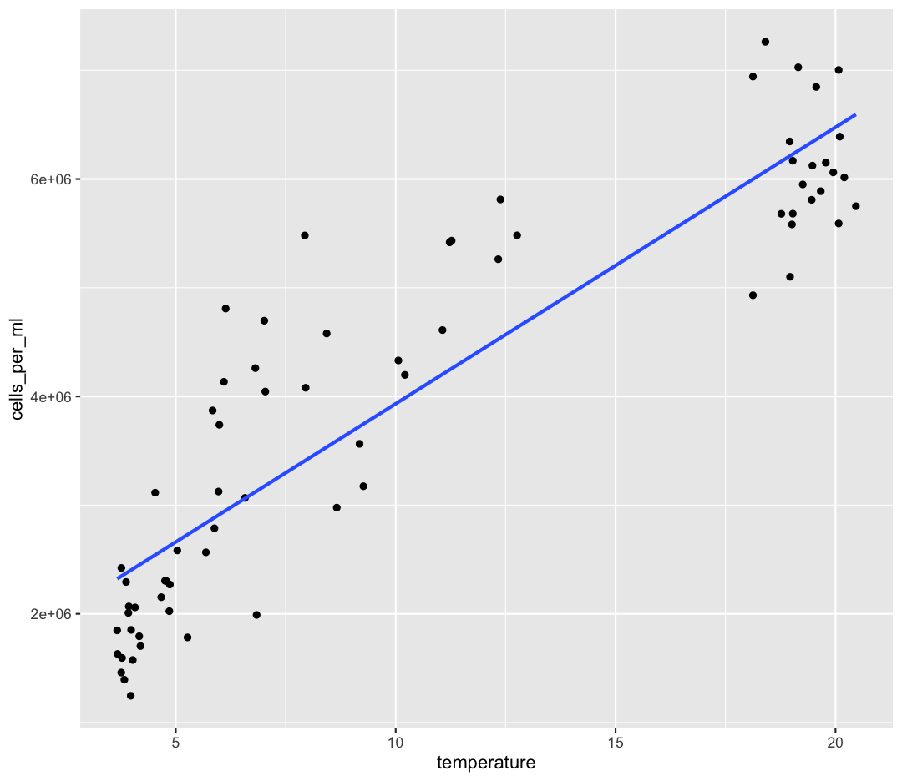

By fitting a linear model to our data, we answer the question: "When temperature increases by one degree, how much does cell abundance generally increase?". We're estimating *coefficients* in a linear models given by:

$$y = \beta_0 + \beta_1x$$
$\beta_0$ corresponds to the *intercept*, or the value of our dependent variable ($y$) when our independent variable ($x$) is zero. 
$\beta_1$ corresponds to the *slope*, which is the amount our dependent variable ($y$) increases when our independent variable ($x$) increases by one unit.

For our cells vs. temperature model our linear model will be:

$$Cells = \beta_0 + \beta_1Temp$$

Now let's fit our linear model. We're going to use the `lm` function, and similar formula notation as we used for our t-tests and ANOVAs. 

~~~
temp_lm <- lm(cells_per_ml ~ temperature, data = sample_and_taxon)

summary(temp_lm)
~~~
{: .language-r}

~~~

Call:
lm(formula = cells_per_ml ~ temperature, data = sample_and_taxon)

Residuals:
     Min       1Q   Median       3Q      Max 
-1154539  -561733  -269119   619870  2073538 

Coefficients:
            Estimate Std. Error t value Pr(>|t|)    
(Intercept)  1389626     180167   7.713 6.69e-11 ***
temperature   254313      14721  17.276  < 2e-16 ***
---
Signif. codes:  0 '***' 0.001 '**' 0.01 '*' 0.05 '.' 0.1 ' ' 1

Residual standard error: 791200 on 69 degrees of freedom
Multiple R-squared:  0.8122,	Adjusted R-squared:  0.8095 
F-statistic: 298.5 on 1 and 69 DF,  p-value: < 2.2e-16
~~~
{: .output}

There's a lot of output here! Let's work through it. 

The first line gives the code which initially created the model. 

The second section, "Residuals" describes the differences between our actual observed values of cells compare to our predicted values of cells. You can think of each "residual" as the vertical distance of our observation from our line of best fit, here shown in red:

~~~
sample_and_taxon %>%
    ggplot() +
    aes(x = temperature, y = cells_per_ml) + 
    geom_segment(aes(x = temperature, xend = temperature,
                 y = cells_per_ml,
                 yend = 1389626 + 254313 * temperature),
             color = "red") + 
    geom_point() + 
    geom_smooth(method = "lm", se = FALSE) 
~~~
{: .language-r}

~~~
`geom_smooth()` using formula = 'y ~ x'
~~~
{: .output}

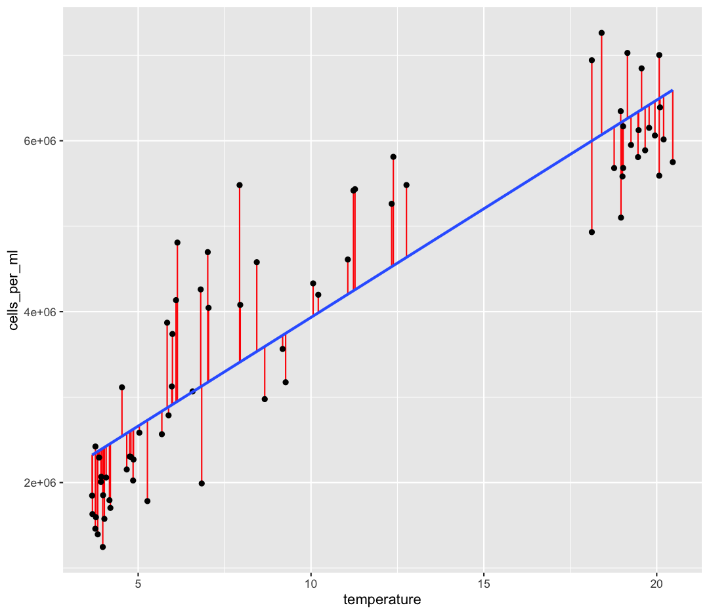

One of the statistical assumptions of linear regression is that the residuals are normally distributed - here, we would expect the Median of the residuals to be close to zero, and the quartiles of the residuals to be symmetrical around zero. We can plot our residuals:

~~~
res_df <- data.frame(res = temp_lm$residuals)

res_df %>%
    ggplot() + 
    aes(x = res) + 
    geom_histogram()
~~~
{: .language-r}

~~~
`stat_bin()` using `bins = 30`. Pick better value with `binwidth`.
~~~
{: .output}

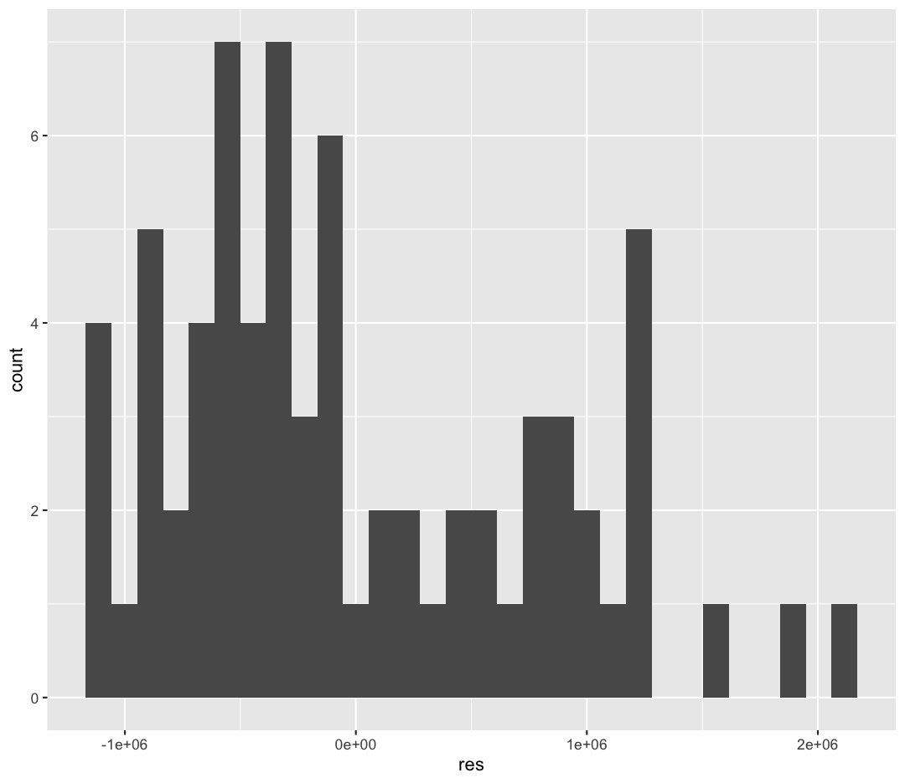

These residuals don't look very normal, which may indicate that a linear model isn't the best fit for these data. There are other diagnostic plots we could make to investigate the distribution of the residuals, and other relationships (like logarithmic or polynomial models) which could be a better fit, but we won't discuss those today.

The next section in "Coefficients". These are the values for $\beta_0$ and $\beta_1$ that we've estimated, which is under the `Estimate` column. The `(Intercept)`, or $\beta_0$, is 1,389,626 cells. This means that when our temperatures are zero, we would still expect there to be 1,389,626 cells per ml. The slope/$\beta_1$/`temperature` term is 254,313 cells/ml. This means that when the temperature rises by 1°, our average cells per ml rises by 254,313 cells per ml. 

The next three columns of the Coefficients section help us estimate how confident we are in our model coefficients. We'll focus on the `Pr(>|t|)` column. This is the p-value that came from...hypothesis tests! The hypothesis that we were testing for each of the coefficients are as follows:

1. Null Hypothesis: The value of the coefficient is zero. As temperature changes, there is no predictable change in cell abundance.

2. Alternative Hypothesis: The value of the coefficient is *not** zero

Because both of our terms have very small p-values, we have high confidence in these coefficients. Especially for the slope, this allows us to conclude that there is a relationship between temperature and cell abundance.

Residual standard error is the *average residual*, which is the distance from each of our observations to our line of best fit. This is nice, because it's in the same units as our dependent variable (cells/ml). So we can say something like "on average, our observations differed from our model by 791,200 cells/ml). Whether this is an acceptable amount of error depends on the system and variable we're studying. Is 791,200 cells/mL a lot? Discuss. 

We then have two measures of the R-squared ($R^2$) value. The $R^2$ represents the percentage of variance in our dependent variable (cells/ml) which we can explain using our independent variable (temperature). The $R^2$ ranges from 0 (no variance explained) to 1 (all our observations fall perfectly on our line of best fit). The Adjusted R-squared becomes more important as we add additional predictors (independent variables) to our model, which is called "multiple regression", and which we won't discuss today. 

Finally, the last line contains the outputs of *another* hypothesis test! This test's hypotheses are:

1. Null Hypothesis: Our model is no better at predicting cells/ml than just guessing the average cells/ml. There is no relationship between cells and temperature, and so knowing the temperature does not improve our ability to predict cells/ml.

2. Alternative Hypothesis: Our model is better at predicting cells/ml than just guessing the mean. 

Because the p-value is very small, we can reject our null hypothesis and conclude that our model is still significantly better at predicting cells/ml than just guessing the average cell abundances every time! 

> ## Why so much output?!?
> 
> All these different metrics might feel overwhelming - sometimes you just want the slope! However the benefit of using a program like R is that you can be much more discerning about the quality of your linear regression. These considerations become increasingly important as your models become more complex and difficult to interpret. 
{: .callout}

## Bonus: Cleaning Stats Output
_[Back to top](#contents)_

You may have noticed the outputs of our statistical tests often hold multiple pieces of information. This can include group means, confidence intervals, p-values, and coefficients. In order to store all these different pieces of information, many of these tests return objects called "lists", which are good at holding multiple types of information. For beginning coders, however, lists (and the data they hold) can be difficult to parse. Even experienced coders often want simpler outputs from these statistical tests, to then include in their results. 

A favorite package of ours is called `broom`, which helps simplify the outputs of statistical tests to the most pertinent information. Let's first install `broom`. 

~~~
install.packages("broom")
~~~
{: .language-r}

The function we'll use from the broom package is called `tidy`. Let's see what `tidy` does to our t-test and ANOVA outputs. 

~~~
library(broom)
~~~
{: .language-r}

~~~
Warning: package 'broom' was built under R version 4.3.3
~~~
{: .warning}

~~~
t.test(Bacteroidota ~ env_group, data = no_deep) %>%
    tidy()
~~~
{: .language-r}

~~~
# A tibble: 1 × 10
  estimate estimate1 estimate2 statistic  p.value parameter conf.low conf.high
     <dbl>     <dbl>     <dbl>     <dbl>    <dbl>     <dbl>    <dbl>     <dbl>
1    0.180     0.280     0.100      12.9 9.50e-14      29.9    0.151     0.209
# ℹ 2 more variables: method <chr>, alternative <chr>
~~~
{: .output}

~~~
aov(Bacteroidota ~ env_group, data = sample_and_taxon) %>%
    tidy()
~~~
{: .language-r}

~~~
# A tibble: 2 × 6
  term         df sumsq  meansq statistic   p.value
  <chr>     <dbl> <dbl>   <dbl>     <dbl>     <dbl>
1 env_group     2 0.564 0.282        139.  8.76e-25
2 Residuals    68 0.138 0.00202       NA  NA       
~~~
{: .output}

~~~
aov(Bacteroidota ~ env_group, data = sample_and_taxon) %>%
    TukeyHSD() %>%
    tidy()
~~~
{: .language-r}

~~~
# A tibble: 3 × 7
  term      contrast          null.value estimate conf.low conf.high adj.p.value
  <chr>     <chr>                  <dbl>    <dbl>    <dbl>     <dbl>       <dbl>
1 env_group Shallow_May-Deep           0   0.194    0.162     0.226        0    
2 env_group Shallow_Septembe…          0   0.0136  -0.0183    0.0455       0.565
3 env_group Shallow_Septembe…          0  -0.180   -0.211    -0.150        0    
~~~
{: .output}

~~~
lm(cells_per_ml ~ temperature, data = sample_and_taxon) %>%
    tidy()
~~~
{: .language-r}

~~~
# A tibble: 2 × 5
  term        estimate std.error statistic  p.value
  <chr>          <dbl>     <dbl>     <dbl>    <dbl>
1 (Intercept) 1389626.   180167.      7.71 6.69e-11
2 temperature  254313.    14721.     17.3  9.24e-27
~~~
{: .output}

The output of `tidy` is **always** a tibble/data.frame, which we have lots of experience working with! For instance, you could use your knowledge of the `filter` command to select a specific contrast from your Tukey HSD test, or only select terms in a linear model which are significant. 

## Integrating it all together!
_[Back to top](#contents)_

You've learned so much in the past two days - how to use the Unix Shell to move around your computer, how to make pretty plots and do data analysis in R, and how to incorporate it all into a report which you can share with Collaborators via Github! Don't worry - if you have questions, the instructor and helpers are here to help you out!

1. Make a new R Markdown file.
1. Give it an informative title.
1. Delete all the unnecessary Markdown and R code (everything below the setup R chunk).
1. Save it to the `reports` directory as LASTNAME_Ontario_Report.Rmd

Work through the exercises below, adding code chunks to analyze and plot the data, and prose to explain what you're doing. Make sure to knit as you go, to make sure everything is working. 

The exercises below give you some ideas of directions to pursue. These are nice exercises because we have the solutions saved. However, you're welcome to branch out as well! Maybe you have your own hypotheses you'd like to test. Maybe you want to explore a new type of ggplot. Perhaps you want to run some statistical tests.  

Just remember to use a combination of prose (writing) and code to document the goals, process, and outputs of your analysis in your RMarkdown report. 

Once you're done, *add* your report to your Git repo, *commit* those changes, and *push* those changes to Github. If you feel comfortable, post a link to the repo on the Etherpad, and [change your repo's settings to **Public**](https://docs.github.com/en/repositories/managing-your-repositorys-settings-and-features/managing-repository-settings/setting-repository-visibility#changing-a-repositorys-visibility), so that others in the class can admire what you've accomplished!

### Bonus Exercises
_[Back to top](#contents)_

[1] The very first step is to read in the sample_and_taxon dataset, so do that first! Also load the `tidyverse` package.

> ## Solution
> 
> ~~~
> library(tidyverse)
> sample_and_taxon <- read_csv('data/sample_and_taxon.csv')
> ~~~
> {: .language-r}
> 
> 
> 
> ~~~
> Rows: 71 Columns: 15
> ── Column specification ─────────────────────────────────────────────────────────────────────────────────────────────────────────────────────────────────────────────────────────────
> Delimiter: ","
> chr  (2): sample_id, env_group
> dbl (13): depth, cells_per_ml, temperature, total_nitrogen, total_phosphorus...
> 
> ℹ Use `spec()` to retrieve the full column specification for this data.
> ℹ Specify the column types or set `show_col_types = FALSE` to quiet this message.
> ~~~
> {: .output}
{: .solution}

#### Investigating nutrients and cell density
_[Back to top](#contents)_

[2] Make a scatter plot of total_nitrogen vs. cells_per_ml, separated into a plot for each env_group. **Hint:** you can use `facet_wrap(~column_name)` to separate into different plots based on that column.

> ## Solution
> 
> ~~~
> ggplot(sample_and_taxon, aes(x=total_nitrogen,y=cells_per_ml)) +
> geom_point() +
> facet_wrap(~env_group)
> ~~~
> {: .language-r}
> 
> 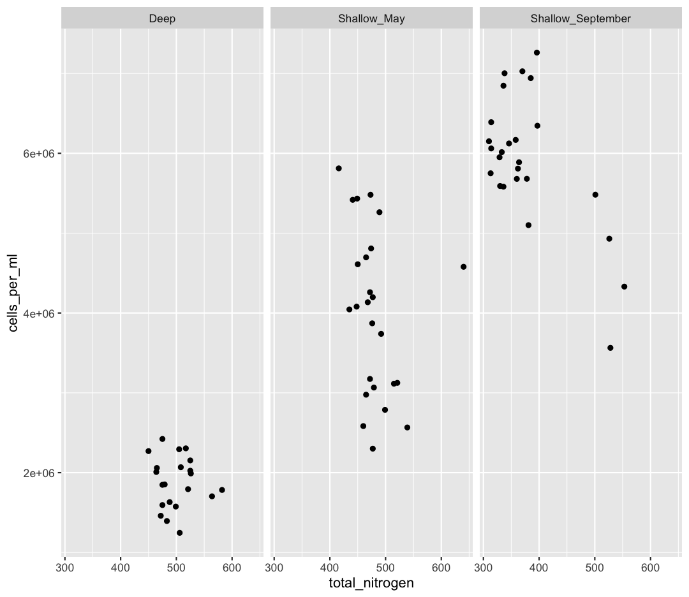
{: .solution}

[3] It seems like there is an outlier in Shallow_May with very high nitrogen levels. What is this sample? Use a combination of `filter` and `arrange` to find out.

> ## Solution
> 
> ~~~
> sample_and_taxon %>% 
>  filter(env_group == "Shallow_May") %>% 
>  arrange(desc(total_nitrogen))
> ~~~
> {: .language-r}
> 
> 
> 
> ~~~
> # A tibble: 25 × 15
>    sample_id env_group   depth cells_per_ml temperature total_nitrogen
>    <chr>     <chr>       <dbl>        <dbl>       <dbl>          <dbl>
>  1 May_8_E   Shallow_May     5     4578830.        8.43            640
>  2 May_29_M  Shallow_May    19     2566156.        5.69            539
>  3 May_29_E  Shallow_May     5     3124920.        5.97            521
>  4 May_33_M  Shallow_May    20     3114433.        4.53            515
>  5 May_43_E  Shallow_May     5     2787020.        5.88            499
>  6 May_17_E  Shallow_May     5     3738681.        5.99            492
>  7 May_66_E  Shallow_May     5     5262156.       12.3             489
>  8 May_35_B  Shallow_May    27     3066162.        6.57            479
>  9 May_48_B  Shallow_May    35     2300782.        4.79            477
> 10 May_717_E Shallow_May     5     4197941.       10.2             477
> # ℹ 15 more rows
> # ℹ 9 more variables: total_phosphorus <dbl>, diss_org_carbon <dbl>,
> #   chlorophyll <dbl>, Proteobacteria <dbl>, Actinobacteriota <dbl>,
> #   Bacteroidota <dbl>, Chloroflexi <dbl>, Verrucomicrobiota <dbl>,
> #   Cyanobacteria <dbl>
> ~~~
> {: .output}
{: .solution}

[4] Where was this sample again? Let's look at a map:

Wow! This sample is right outside of Toronto.

We also see that Shallow September has four strange points, with high nitrogen and low cell counts. Let's use a new geom, `geom_text` to figure out what those samples are (this might take some googling!). Also, let's use `filter` to only plot samples from "Shallow_September".

> ## Solution
> 
> ~~~
> sample_and_taxon %>%
>   filter(env_group == "Shallow_September") %>%
>   ggplot(aes(x = total_nitrogen, y = cells_per_ml)) + 
>   geom_text(aes(label = sample_id))
> ~~~
> {: .language-r}
> 
> 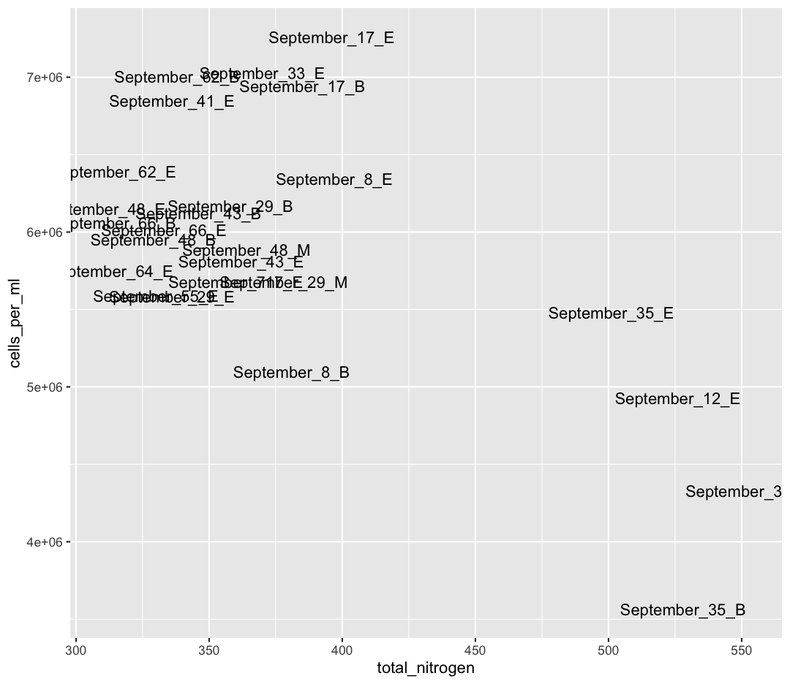
{: .solution}

Interesting...these are mostly from Station 35. I wonder why these stations have such high nitrogen and such low cell abundances? 

> ## Solution
> 
> Here, I show surface temperatures across the lake in September. Station 35 was on the edge an upwelling event, where cold, nutrient rich water is pulled to the surface of the lake! Stn. 38, which was smack dab in the upwelling itself, was so similar to deep samples that its env_group is "Deep" rather than "Shallow_September".
{: .solution}

If you want to investigate this phenomenon further, spend time analyzing the relative composition of Phyla in these upwelling stations compared to the rest of Shallow_September. If you want to go further, you can use the buoy_data from the Niagara and South Shore buoys to see if you can detect when this upwelling event began.

#### Comparing Dominant Phylum Across Environmental Groups
_[Back to top](#contents)_

[6] We want to know which Phyla tend to live in which environments. Previously, we focused on Chloroflexi, and found it preferred Deep environments. What if we want to look at the relative abundances of all our Phyla between env_groups at once?

First, let's remind ourselves how we looked at Chloroflexi across env_groups. Make a boxplot with env_group on the x-axis, and Chloroflexi relative abundance on the y axis.

> ## Solution
> 
> ~~~
> sample_and_taxon %>%
>   ggplot(aes(x = env_group, y = Chloroflexi)) + 
>   geom_boxplot()
> ~~~
> {: .language-r}
> 
> 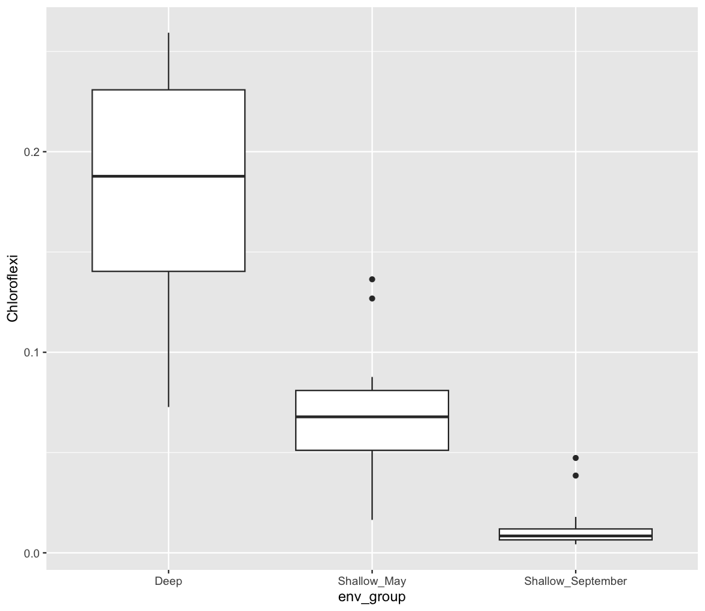
{: .solution}

[7] Now, we want to analyze multiple Phyla at once. Because our taxa abundances are in wide format, we can't use multiple Phyla in a single ggplot. As such, we will need to convert our data to long format. Using `pivot_longer`, convert the columns containing our Phyla abundances from wide to long.

> ## Solution
> 
> ~~~
> sample_and_taxon %>%
>   pivot_longer(cols = Proteobacteria:Cyanobacteria, names_to = "Phylum", values_to = "Abundance")
> ~~~
> {: .language-r}
> 
> 
> 
> ~~~
> # A tibble: 426 × 11
>    sample_id env_group   depth cells_per_ml temperature total_nitrogen
>    <chr>     <chr>       <dbl>        <dbl>       <dbl>          <dbl>
>  1 May_12_B  Deep         103.     2058864.        4.07            465
>  2 May_12_B  Deep         103.     2058864.        4.07            465
>  3 May_12_B  Deep         103.     2058864.        4.07            465
>  4 May_12_B  Deep         103.     2058864.        4.07            465
>  5 May_12_B  Deep         103.     2058864.        4.07            465
>  6 May_12_B  Deep         103.     2058864.        4.07            465
>  7 May_12_E  Shallow_May    5      4696827.        7.01            465
>  8 May_12_E  Shallow_May    5      4696827.        7.01            465
>  9 May_12_E  Shallow_May    5      4696827.        7.01            465
> 10 May_12_E  Shallow_May    5      4696827.        7.01            465
> # ℹ 416 more rows
> # ℹ 5 more variables: total_phosphorus <dbl>, diss_org_carbon <dbl>,
> #   chlorophyll <dbl>, Phylum <chr>, Abundance <dbl>
> ~~~
> {: .output}
{: .solution}

You can see that we've now made size rows per sample, one for each Phylum. This does mean that our metadata has been duplicated, which is okay right now.

Now, our data is in the correct format for plotting with ggplot. In the end, we want a plot that shows, for each env_group, the relative abundance of each Phylum. There are actually many plotting styles we could use to answer that question! We'll try out three. 

[8] Pipe your long dataframe into a boxplot with env_group on the x-axis, and Abundance on the y-axis. Use fill to differentiate different Phyla

> ## Solution
> 
> ~~~
> sample_and_taxon %>%
>   pivot_longer(cols = Proteobacteria:Cyanobacteria, names_to = "Phylum", values_to = "Abundance") %>%
>   ggplot(aes(x = env_group, y = Abundance, fill = Phylum)) + 
>   geom_boxplot()
> ~~~
> {: .language-r}
> 
> 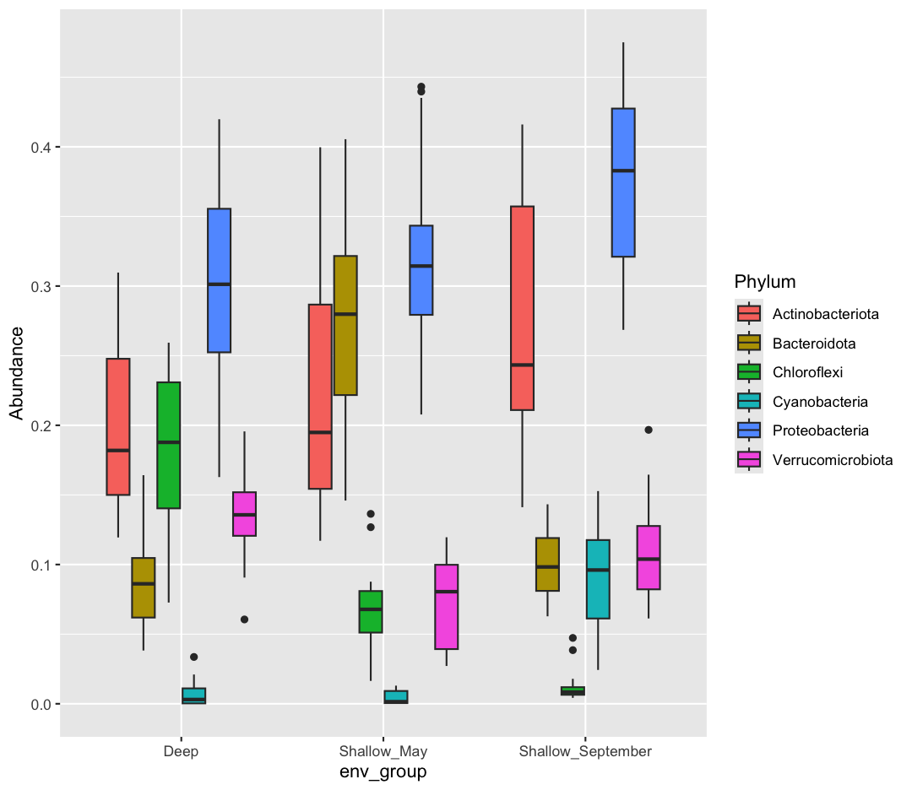
{: .solution}

[9] Okay, what does this plot tell us? Make sure to write a quick summary in your report. Next, make a new plot, where Phylum is now on the x-axis, and the fill is determined by the env_group.

> ## Solution
> 
> ~~~
> sample_and_taxon %>%
>   pivot_longer(cols = Proteobacteria:Cyanobacteria, names_to = "Phylum", values_to = "Abundance") %>%
>   ggplot(aes(x = Phylum, y = Abundance, fill = env_group)) + 
>   geom_boxplot()
> ~~~
> {: .language-r}
> 
> 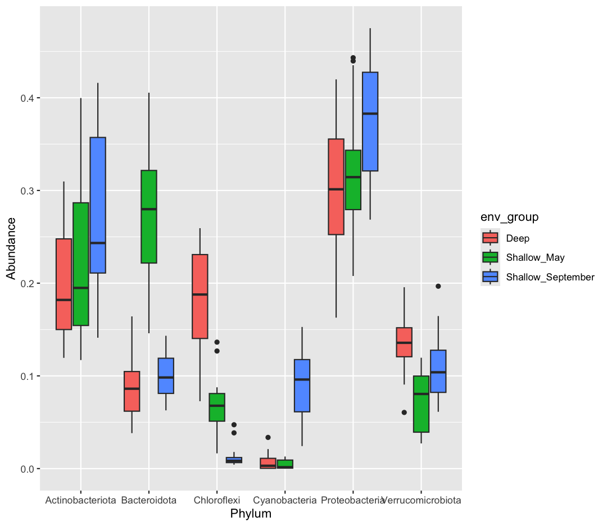
{: .solution}

[10] Which do you prefer? Which do you feel is easier to understand? Finally, let's use faceting, rather than fill, to separate out Phyla

> ## Solution
> 
> ~~~
> sample_and_taxon %>%
>   pivot_longer(cols = Proteobacteria:Cyanobacteria, names_to = "Phylum", values_to = "Abundance") %>%
>   ggplot(aes(x = env_group, y = Abundance)) + 
>   geom_boxplot() + 
>   facet_wrap(~Phylum)
> ~~~
> {: .language-r}
> 
> 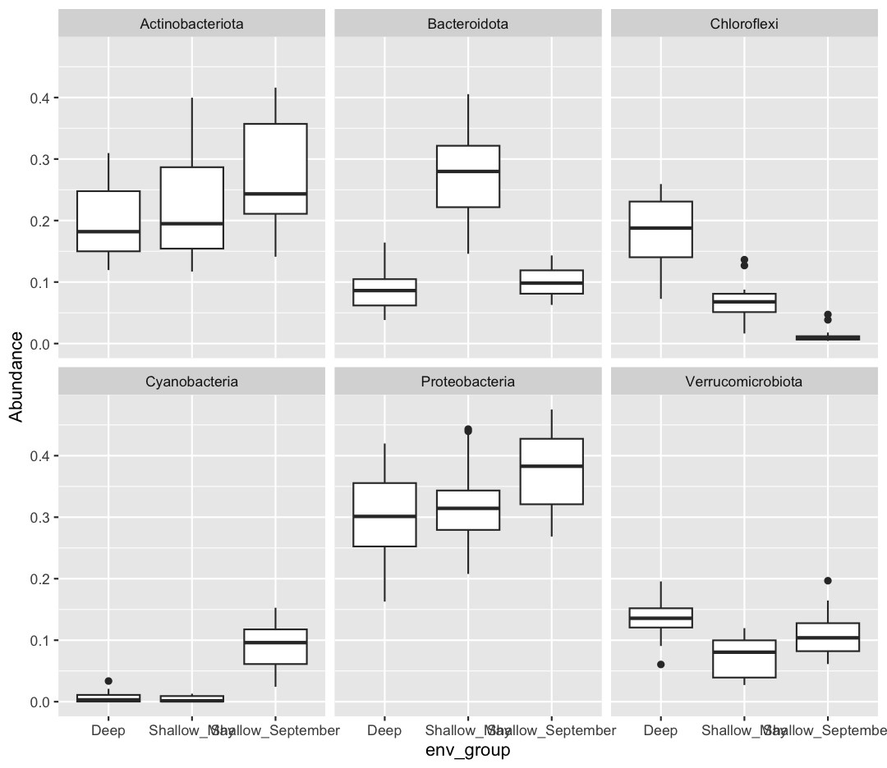
{: .solution}

If you want to investigate this dataset further, consider changing the x-axis to a continuous variable, like temperature, rather than the categorical env_group. Can you find associations between different environmental conditions and the abundance of specific taxa?

### Bonus-Bonus: Let your creativity shine!

If you've gotten this far, feel free to let your creativity shine. Consider:

1. Make your plots beautiful and professional:
 - Alter axis labels
 - Use `theme` to change the font size of axis and legend text
 - Using or creating a beautiful palette from a new package
2. Render your report in different formats, including pdf or docx
3. Find a partner and use Github to collaborate on a shared RMarkdown document.
