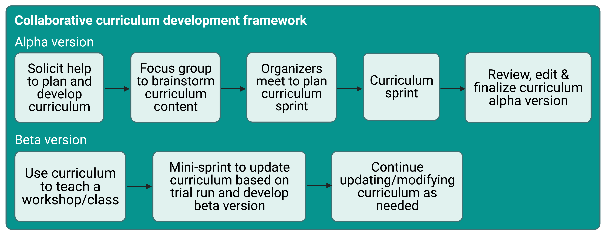

TODO: revisit the title after we draft the manuscript.

# Summary

TODO

# Statement of need

The University of Michigan instance of Software Carpentry has taught workshops
using the curriculum created by the Software Carpentry organization since 2015.
In that time, our instructors have found several advantages and disadvantages to
using the Software Carpentry curriculum.

Pros:
- modular: so you can choose any programming language lesson (e.g. R or Python) to pair with lessons on the unix shell and version control.
- well-established: it has been refined over years by many contributors and taught at workshops around the world.
- pedagogy: contains short quizzes & exercises at the end of topic chunks for formative assessment.

Cons:
- the modular nature of the curriculum means that each lesson is independent from the others, so there is not a natural flow and it is not apparent to learners how to integrate all of the skills together for reproducible research projects.
- there is too much content for the time allotted in a two-day workshop, so instructors are expected to pick what content to teach and what to skip. this makes workshops inconsistent (because slightly different content is taught each time). it also takes a significant time investment for instructors to prepare to teach, which is especially burdensome/overwhelming for new instructors.

TODO: We sought to create a new curriculum that...

goals for our curriculum:
- Flexible for virtual or in-person format.
- Lessons should build on each other, rather than being completely independent/disconnected.
- Use the same dataset (gapminder).
- Showcase the workflow we use in our own work. e.g. lessons after Git & GitHub should use the add/commit/push/pull workflow throughout.
- Appropriate amount of content for the time allotted. Instructors should not have to customize the curriculum to fit into the workshop time frame
- Have challenge questions available for fast learners / in case the workshop goes faster than usual.
- Have short quizzes & exercises at the end of topic chunks just like Carpentries do for “Formative assessment”.
- Teach learners what we actually use in our work, don't teach them what we don't use.

TODO: curriculum sprint, pilot workshop, continuing development.

# The Curriculum

## Learning Objectives

## Course Content

## Instructional Design
<!-- teaching philosophy / pedagogy -->

## Pilot Workshop

# Acknowledgements

We thank the Carpentries organization for their workshop protocols and
open-source Software Carpentry curriculum, upon which this curriculum is based.

We thank Victoria Alden and Scott Martin for assisting us in organizing and
advertising our workshop.
We thank the learners who participated in the workshop.

# Funding

Salary support for PDS came from NIH grant 1R01CA215574.
KLS received support from the NIH Training Program in Bioinformatics (T32
GM070449).
ZL received support from the National Science Foundation Graduate Research
Fellowship Program under Grant No. DGE 1256260.
Any opinions, findings, and conclusions or recommendations expressed in this
material are those of the authors and do not necessarily reflect the views of
the National Science Foundation.

# Author contributions

ZL and KLS contributed equally. ZL is first among the co-first authors because
KLS threatened to reject all pull requests where ZL put KLS first.

PDS supervised the project.
ZL and KLS organized the initial sprint, led the development of the curriculum,
and drafted the manuscript.
ZL, KLS, JK, and ML instructed at the first pilot workshop
while CA, JM, ST, SKL, SJ, and CB assisted learners.
All authors contributed to the development of the curriculum.

# Conflicts of interest

None.

# References
